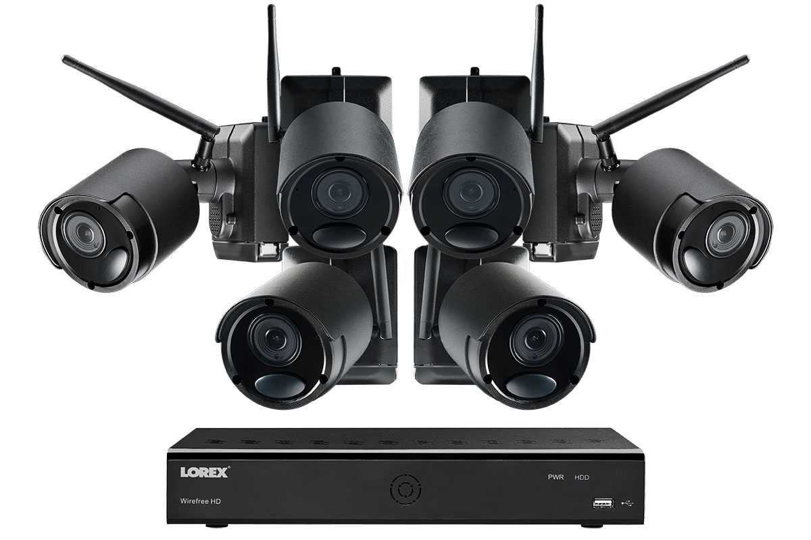

import Overview from "../components/Overview"
import StickyHeader from "../components/StickyHeader"

There are so many cameras on the market nowadays that it can be overwhelming to find the right one for you. Most people want something easy to install, simple to use, and no monthly price. If you are going to spend a few hundred upfront why should you have to pay monthly right? In this article I am going to cover what I think are the 3 best outdoor security cameras that don’t have subscriptions.

All cameras in this article have the following….

- No monthly subscription

- No wires (all cameras below are wireless for easy installation)

- Apps on smartphone for remote viewing

Listed below are links in which I do receive a small commission at no extra charge to you if you end up purchasing that item.

## What is the best home security camera system without monthly fee?

The two best home security camera systems are Eufy Life and Lorex. Both of these brands provide their own wireless DVR which you can access from an app. The app comes free of charge so you never have to worry about paying a monthly fee to use your cameras.

<StickyHeader title="Eufy Cameras" link="https://amzn.to/2GC1gbO" id="Eufy" />

<Overview
  pros={[
    "No Monthly Fee",
    "High Quality Video",
    "DVR Included for local storage",
    "Battery lasts 365",
  ]}
  cons={["Only 2 cameras included", "Wifi Required"]}
/>

Eufy life is one of the easiest cameras to install and operate. You simply attach the mount on the home and then attach the camera to the mount. Since the camera is powered by batteries, you don’t have to worry about running any wires throughout the home.

The way the cameras connect to your DVR is by wifi. You simply insert an SD card into your DVR and the cameras will connect to it via wifi. This means that you can store all of your video locally which prevents a monthly expense. This is handy in case you need to take the video and post it online because you can insert the SD card into your computer just like you would a digital camera.

<iframe
  width="560"
  height="315"
  src="https://www.youtube.com/embed/qLLE0dRzMpM"
  frameborder="0"
  allow="accelerometer; autoplay; clipboard-write; encrypted-media; gyroscope; picture-in-picture"
  allowfullscreen
></iframe>

The cameras that you get are very high quality. They are a full 1080p and night vision. So you can very easily make out faces, license plate numbers etc. The app on your phone is also easy to set up. You can receive notifications to your smartphone and know when someone is approaching the door. This way you can only be alerted when there is motion going on around the house.

I think this camera will solve most people’s problems for their outdoor camera needs.

[See all Eufy Camera Packages)(https://amzn.to/2GC1gbO)

<StickyHeader
  title="Lorex Cameras (4 Pack)"
  link="https://amzn.to/3iQvxkk"
  id="Lorex-4"
/>

<Overview
  pros={[
    "No Monthly Fee",
    "High Quality Video",
    "DVR Included for local storage",
  ]}
  cons={["4 month battery life", "no audio"]}
/>

Pros:4 camera package, no monthly fee, stores video for a month, ability to view from computer or app
Cons: 4 month battery life, narrow field of view

This camera system comes with 4 battery powered cameras that make for an easy installation. The DVR connects to the cameras via wifi and stores all of the video there. Since it is all stored wirelessly you can avoid all monthly costs.

<iframe
  width="560"
  height="315"
  src="https://www.youtube.com/embed/m4v4a2_oxO4"
  frameborder="0"
  allow="accelerometer; autoplay; clipboard-write; encrypted-media; gyroscope; picture-in-picture"
  allowfullscreen
></iframe>

If you want to view the cameras remotely, you can download the app to your phone or their software to your computer. This way you can view the cameras anywhere you are at as long as you have wifi or cell service. This all comes at no extra charge.

The camera quality is really good too. The cameras are a full 1080p and they are equipped with night vision. This allows you to see everything around the house very well even if it is pitch black. Unfortunately it does not come with a microphone so there is no audio with this camera. Many [wireless cameras come with it nowadays](/posts/best-battery-powered-security-cameras-for-outdoors), but for some people that is more of a nice to have feature rather than a MUST have.

The 4 camera set up allows you to install one on each side of the house to get a full 360 view of the home. This setup will be easy to handle without having to sacrifice quality.

[View this camera package](https://amzn.to/3iQvxkk)

<StickyHeader
  title="Lorex Cameras (6 Pack)"
  link="https://amzn.to/3lBjl8X"
  id="Lorex-6"
/>

<Overview
  pros={["No Monthly Fee", "1 Terrabyte of video storage", "Audio"]}
  cons={["Price"]}
/>
The next camera set up is the 6 camera packaged from Lorex. This camera set up is like the bigger brother from the package I just went over from before.  These cameras are also battery powered which makes it truly wireless. You simply attach the mount to the home and then attach the camera to the mount.

Once the cameras are installed, you will connect the DVR and the cameras to your wifi. This way they can talk to each other. Since the video storage is local, you avoid all monthly costs. If you want to view the cameras remotely, you will just download their app to your phone.

The cameras come with a 1080p lens and they are night vision. Unlike the other package, these cameras come with 2 way talk. This means that you can speak to people through the camera and even pick up on their audio.

The one Terrabyte DVR will allow you to store plenty of video! You will be able to save all of your videos and go back and watch them at any time. This system has the biggest video storage that I know of for a wireless camera system that doesn’t include a monthly price.

[View this Camera Package](https://amzn.to/3lBjl8X)

## Final Thoughts

These are the top three camera packages that don’t have a monthly price. Some cameras will offer a free 24 hour recording period, but if you want more then you have to pay. My goal with this review was to provide 3 great options that are truly no monthly cost. If you found this review helpful, you can check out my [other reviews of home security systems here.](/posts/best-home-security-systems)
