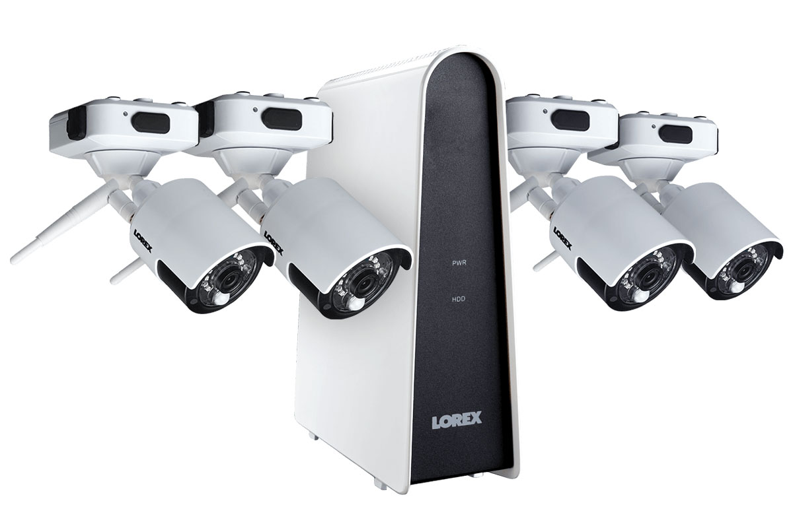

import Overview from "../components/Overview"
import StickyHeader from "../components/StickyHeader"

The best outdoor wireless security cameras that come with a DVR are from Eufy life and Lorex. Since these cameras come with a DVR they do not have a monthly fee with them. They can store all of their footage wirelessly through wifi. This helps make the install easier because you don’t have to run wires all throughout the house. The cameras themselves are also wireless and they run on batteries. This makes it extremely easy to install yourself without having to sacrifice quality.

## How far can a wireless security camera transmit?

Wireless cameras can transmit as far as it can reach wifi. Since the cameras use wifi to reach their hub, they will need to be within range to be able to connect.

## Do you need a DVR for wireless security cameras?

You do not need a DVR for all cameras. Nowadays, many cameras just come with a hub that connects to the wifi and stores all the video into the cloud. Usually there are fees attached since you are using their cloud storage to store all of your videos.

The cameras mentioned here do not have any monthly fees, but do give you the ability to view everything remotely via their app.

<StickyHeader title="Eufy Cameras" link="https://amzn.to/2GC1gbO" id="Eufy" />

<Overview
  pros={[
    "No Monthly Fee",
    "High Quality Video",
    "DVR Included for local storage",
    "Battery lasts 365",
  ]}
  cons={["Only 2 cameras included", "Wifi Required"]}
/>

Eufy has some of the best cameras when it comes to a complete wireless set up. The battery life on these cameras is for 365 days until they need to be recharged. This is a lot longer than some of its competitors.

Inside of the Eufy base station is a place to put in a micro SD card where all the video will be stored. The camera and base station connect to your wifi which allows the videos being recorded to transfer to the base station and be saved on the SD card. At any moment, you can pull the SD card out and watch the video on your computer.

The cameras themselves are very high quality. They come with a full 1080p lens and night vision. This will give you crystal clear video needed to see faces and license plate numbers easily. Once you download their app, you can watch all the cameras in real time. If you choose to set up notifications, you can also be alerted whenever there is activity in front of the camera because there is a built in motion sensor. Overall it is a great camera that comes with a DVR.

<iframe
  width="560"
  height="315"
  src="https://www.youtube.com/embed/qLLE0dRzMpM"
  frameborder="0"
  allow="accelerometer; autoplay; clipboard-write; encrypted-media; gyroscope; picture-in-picture"
  allowfullscreen
></iframe>

[See all Eufy Camera Packages)(https://amzn.to/2GC1gbO)

<StickyHeader
  title="Lorex Cameras (4 Pack)"
  link="https://amzn.to/3iQvxkk"
  id="Lorex-4"
/>

<Overview
  pros={[
    "No Monthly Fee",
    "High Quality Video",
    "DVR Included for local storage",
  ]}
  cons={["4 month battery life", "no audio"]}
/>

The Lorex cameras are another great option because they come with batteries built inside of the cameras themselves so you don’t have to worry about drilling any holes to run wires through. It also comes with a DVR that you can connect to your wifi as well. Once everything is connected to the wifi, these cameras will be able to store all of its videos to the DVR locally. This will prevent you from having to pay for a monthly cost.

The DVR can store video for up to one month before it will automatically delete the oldest video and replace it with the newest video. This should be plenty of storage to go back and grab any video and save it to your computer if you need to.

The camera comes with a high quality 1080p lens and is equipped with night vision. You can expect to get lots of details through the lens of this camera. If you want to view the camera remotely you can simply download the app on your phone or download the software on your computer to be able to watch everything remotely. The downside to this camera is that there is no audio. This is [becoming a standard feature nowadays](/posts/best-battery-powered-security-cameras-for-outdoors) and unfortunately this camera is lacking it.

<StickyHeader
  title="Lorex Cameras (6 Pack)"
  link="https://amzn.to/3lBjl8X"
  id="Lorex-6"
/>

<Overview
  pros={["No Monthly Fee", "1 Terrabyte of video storage", "Audio"]}
  cons={["Price"]}
/>

The big brother to the package discussed previously is the 6 camera pack from Lorex. These cameras work just like the others. There are batteries inside of the cameras so you don’t have to worry about running wires through the house. The DVR that is included needs to be connected to the wifi so it can store the video that comes from the cameras which is done wirelessly. This DVR comes with 1 terabyte of storage. This will allow for months of video to be stored on it.

This package comes with 2 additional cameras, which will give you a lot more coverage all around the home. You truly can get a full 360 view with this camera set up. The quality is similar to the other camera package that includes a 1080 p lens along with an app on your phone to be able to watch everything. The major difference is that this camera set up comes with audio! Built inside of the camera is a microphone that gives you the ability to hear what is going on outside of your home.

[View this Camera Package](https://amzn.to/3lBjl8X)

## Final Thoughts

These cameras are great if you need something that can handle the outdoors without having to run a bunch of wires. The install is easy and can be done in just a few hours. The included DVR can help save on monthly costs which is nice too. If you are interested in adding on an alarm system too, [you can check out my article reviewing the best home security systems](/posts/best-home-security-systems).
