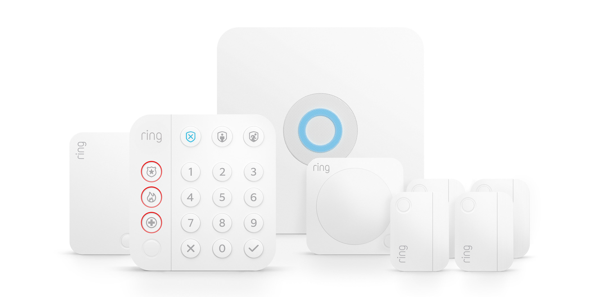

import Overview from "../components/Overview"
import StickyHeader from "../components/StickyHeader"

## Can you get a security system in an apartment?

Yes, you can get a security system in an apartment. Almost all apartment complexes allow for a security system. Most people get a wireless system so that there is no drilling involved.

Finding a cheap security system that is designed for apartments can be difficult. There are so many options on the market right now. The 3 options that I will go over have an **affordable monthly rate** and **no contract**. These systems are all yours to keep and **nation wide**. That means that you can take the system anywhere with you and reactivate it into your new home.

Another option that is important to people in apartments is having a **wireless system**. The options that I will review today are all wireless. This means that you can take equipment **WITHOUT damaging anything**. All these systems use adhesive stickons so you can simply peel the sensors off when you move out. The landlord will never know that you had a system to begin with. The companies listed below do contain links where if you purchase the system using the link I may receive a commission. With that being said, I don’t let any of that influence my opinion.

<StickyHeader
  title="Ring Alarm"
  link="https://shop.ring.com/pages/security-system"
  id="Ring"
/>

<Overview
  pros={[
    "Cheapest Monthly Price",
    "Integrate with Existing Ring Cameras",
    "Wireless Equipment",
    "No Contract",
  ]}
  cons={[
    "Not very many smart home features",
    "High upfront costs",
    "No touchscreen keypad",
  ]}
  price="$9.99 per month plus $199 - $299 upfront for equipment"
  contract="No Contract, just pay upfront for the equipment"
/>

Ring is only $9.99 per month with an upfront cost of $199 for the equipment. Ring has the lowest monthly price out of all of its competitors. That price makes it one of the cheapest security systems. Just because the system is low in price does not mean that it is low in quality. The system comes with a traditional push button keypad that sticks on to the wall, no drilling required. Along with that panel comes a base station that is the main brain of the system. You will need to place this in the center of the home.

The system uses cell phone towers in the area for its monitoring. This means that you do not need a landline or internet for the system to work. As a matter of fact, even if your power goes out you will still have monitoring. The system comes with a backup battery that will power the system in the event of a power outage. This makes the system very reliable.

The response time is really fast. Within seconds of the alarm going off, you are getting phone calls from their monitoring station. If you pick up the phone and don’t know why the alarm is going off then they will send the police out to check things out. Not to mention that the alarm reaches up to 100 decibels. Anyone trying to get in there won’t be staying for very long!

The starter kit comes with an app on your phone that you can use to turn the alarm on and off. This way if you leave the house and forget to turn the alarm on, you can just do it remotely from your phone. The kit also comes with a few door/window sensors and a motion sensor. This is enough to get a normal sized apartment fully covered.

If you want to do all this on a budget then Ring is the way to go! They are going to provide great customer service, equipment, and security for a low price.

[See all Ring packages](https://amzn.to/2GJ4jii)

**Does Ring offer cameras**

Yes, Ring started out making only cameras and then later added on home security. You can check out all of their camera options here. These will all work with the Ring app.

<StickyHeader
  title="SimpliSafe"
  link="https://simplisafe.com"
  id="SimpliSafe"
/>

<Overview
  pros={["Low Monthly Cost", "No Contract", "Wireless Equipment"]}
  cons={[
    "Lack of smart home options",
    "Lack of 3rd party equipment integrations",
  ]}
  price="$14.99 - $24.99 per month plus $183-$299 upfront equipment fees"
  contract="No Contract"
/>

SimpliSafe is another great option for an affordable home security system. Their monthly price is $14.99 per month with an upfront cost of $183 for the equipment. Their system works great and is just as reliable as the Ring alarm. This option comes with no contract either. This means that you can cancel the service and anytime without penalty.

The system comes with a push button keypad and a base station that all the devices will connect to. You can place the base station in a center location in the house and stick the panel on the wall. **There is no drilling required to install this system**. All the sensors just stick on with an adhesive. So when you move out you can peel the sensor off the wall and make it look like you never had it there to begin with.

For \$10 more you can have remote access, or the app on your phone. This way you can control the system remotely from anywhere you are at. This also gives you the ability to view cameras on phone too if you purchase them. They offer a doorbell camera and an indoor camera. I always recommend adding on a few cameras if you are able to do so. This gives the police something to work with if someone does try and break in.

SimpliSafe’s equipment is high quality for what you pay. It is also easy to use and install. I always recommend their system for anyone who is looking for an affordable home security option that fits apartments and small homes.

[See all SimpliSafe’s packages](https://simplisafe.com/home-security-system-foundation)

<StickyHeader
  title="Frontpoint"
  link="https://www.frontpoint.com"
  id="Frontpoint"
/>

<Overview
  pros={[
    "Best All Around for DIY",
    "Upfront Cost is only $99 for Equipment",
    "No Contract",
    "Offers cameras with smart phone app",
  ]}
  cons={["Expensive monthly price"]}
  price="$44.99 or $49.99 per month plus upfront equipment fees ranging between $99-$479"
  contract="No Contract, you must pay for all equipment upfront"
/>

I’m placing frontpoint on here because they offer the lowest cost to get started but their monthly pricing is higher. Their upfront cost starts at $99. This is about half of what Ring’s upfront cost is. The downside to frontpoint is that their monitoring is $44.99 per month. That is a lot more than Ring or SimpliSafe. The good news is that it does include an app on your phone, and it has great compatibility for other smart home items in the home. For example, if you have an automatic door lock or nest thermostat it will appear on your app and give you the ability to control it all from there.

Frontpoint offers all of your standard security options. You can easily secure your whole home with door/window, motion, and glass break sensors. Everything in the home is wireless which makes for an easy set and take down. This way you don’t have to leave a mark when moving out. [I recommended frontpoint in my best security systems review here](/posts/best-home-security-systems)

Frontpoint really starts to shine with its customer service. They have some of the best customer service in the industry. Any time you have a question you can very easily pick up the phone and talk to a live person.

These are three great options you can check out to find a super affordable security system for your apartment. It can be overwhelming with all the the options, but these three are going to be the most bang for your buck in terms of price and quality of equipment and service.
