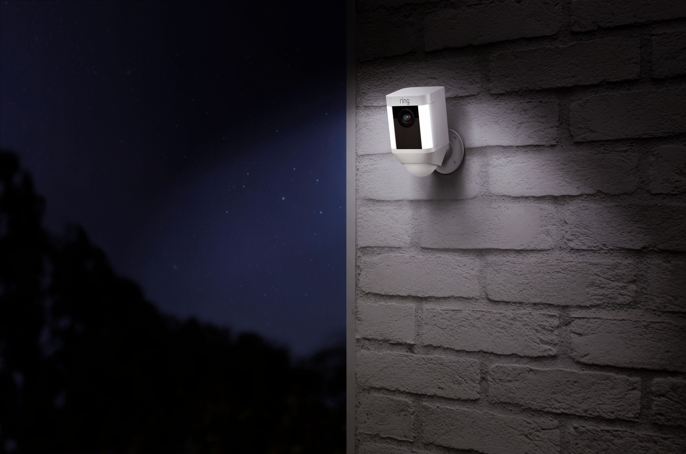

import Overview from "../components/Overview"
import StickyHeader from "../components/StickyHeader"

Security cameras are becoming more and more necessary today because of all the online shopping that we do. People are seeing a rapid increase in packages getting stolen from their porches. Also, if something were to happen to your property it would be nice to see who did it and have video evidence of that person.

In this article I am going to cover the 3 best wireless security cameras that allow for remote viewing from a smartphone or computer.

## What is the best wireless outdoor home security camera system?

Ring, Arlo, and Blink are some of the best wireless outdoor security cameras. All of these cameras come with an app on our smart phone to view things remotely.

These cameras are all affordable and run off of batteries. This makes installing them super easy since you don’t have to drill any holes to run wires through. The batteries last anywhere from 6 months to 2 years depending on the camera.

<StickyHeader
  title="Ring Stick Up Camera"
  link="https://amzn.to/2SnFjzD"
  id="Ring"
/>

<Overview
  pros={[
    "Mobile App to Watch Cameras",
    "Weatherproof",
    "1080p and Night Vision",
  ]}
  cons={[
    "Not very many smart home features",
    "High upfront costs",
    "No touchscreen keypad",
  ]}
/>

The Ring Stick up Camera is one of the best in my opinion. It comes with an app on your smartphone that allows you to watch the cameras anywhere you are at as long as you have cell service or wifi. Built inside of the camera lens is a motion sensor that can alert you whenever something approaches the home. You can also just watch everything in real time from your phone as it happens. If you don’t have access to your phone you can always stream it to your computer.

The camera streams everything in a full 1080p video and is night vision. The battery lasts about 6 months before it needs to be recharged. Since it runs off a battery you don’t have to worry about installing any wires and running them through the house. The other nice feature about this camera is the two way talk ability. You can have a full conversation with anyone around the house all through your phone! This is a great feature to make it look like you are home even if you are away.

[See all Ring Camera Packages](https://amzn.to/2SnFjzD)

<StickyHeader
  title="Arlo Outside Camera"
  link="https://amzn.to/2HOeoLf"
  id="Arlo Outside Camera"
/>

<Overview
  pros={[
    "Watch cameras from app or computer",
    "Weatherproof",
    "1080p and Night Vision",
    "Magnetic Mount",
  ]}
  cons={["Battery only lasts 6 months"]}
/>

Arlo is another great wireless camera option. Arlo has cameras for inside and outside the home. This makes it a great camera system for anyone who wants to be able to see all angles of the house. Once you have the cameras installed, you can download the app on your phone and watch the cameras from there. You can also do it from a computer.

These cameras are similar to Ring because they also have a full 1080p video quality and are night vision. So this will leave you with great video quality to see what is going on around the home. These also come with two way talk ability so you can have a conversation with anyone that is around the home all through your phone.

##How far can a wireless security camera transmit?

Since the cameras need wifi to stream the video, they can be placed as far out as your wifi signal goes. If you need to install a camera in a place that doesn’t have wifi you can [check out my articles here reviewing cameras that run off cell phone towers](/posts//best-wireless-security-cameras-for-outdoors/)

[See all Arlo Camera Packages](https://amzn.to/2HOeoLf)

<StickyHeader
  title="Blink Outside Camera"
  link="https://amzn.to/3jsrpbf"
  id="Blink Outside Camera"
/>

<Overview
  pros={[
    "Most Affordable",
    "Camera Battery Last 2 years",
    "1080p and Night Vision",
  ]}
  cons={["No Magnetic Mount"]}
/>

Blink has some of the most affordable camera options. Just because the camera is cheap doesn’t mean bad quality! These cameras also come with an app that you can download and watch everything that is happening around the home. You can also stream it to a computer. Built inside of the camera lens is a motion sensor that allows you to be alerted whenever someone walks in front of the camera. Once you get the alert on your phone, you can just pull it out and see who is there!

These cameras pack a punch with their tiny design! They are equipped with a 1080p lens and night vision. They also offer two way talk. This is always a nice feature to have because you can tell people to just go away!

I believe that for the price you pay and for the quality that is offered, Blink is the most bang for your buck.

[See all Blink Camera Packages](https://amzn.to/3jsrpbf)

## How can I monitor my security camera remotely?

Security cameras can be viewed remotely with an app on your smartphone or by watching them through your computer.

All of the companies listed above come with an app on your smartphone that you can use to watch your cameras in real time.

Hopefully, you found this article helpful. I have [another review](/posts/best-battery-powered-security-cameras-for-outdoors) that covers these cameras and others in more detail. All of the other cameras in this article also have apps on your phone that you can download to watch them remotely.
