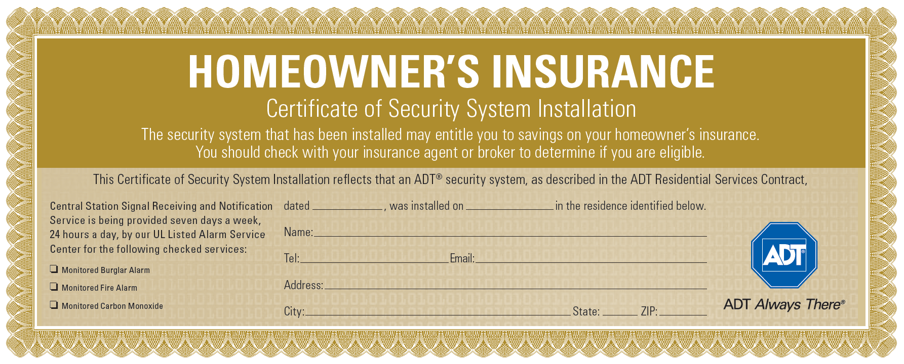

Some companies will give you up to 20% off your homeowners insurance by having an active home security system. It is a great added benefit that most people don’t take advantage of. I want to make sure you save as much money as possible. Let’s take a deep dive into how to obtain your ADT alarm certificate.

## Does ADT give an insurance certificate?

Yes, ADT does provide a certificate that acts as proof for having an alarm system. You will want to show this certificate to your homeowners insurance provider to receive your discount.

Some companies will also accept a receipt from your monthly bill as proof of having a system too.

## How to get your ADT alarm certificate for insurance

In order to get your ADT alarm certificate, you will need to go to [myadt.com](https://www.myadt.com) and login to your account. Once you are logged in, you will click on “My Alarm” tab, then click “System Management”, and finally click “Certificate of Monitoring”.

## Does ADT reduce homeowners insurance cost?

Yes, there are many insurance companies that give discounts if you have an active monitored system from ADT. The discount varies, but some companies give up to 20% off.

The best way to make sure you get the biggest discount possible is to add in fire monitoring with your plan. ADT already includes fire within your monthly price so you don’t have to worry about paying extra monthly. However, you will need a smoke detector from ADT in order to have them be alerted for fire.

## How much do you actually save with a home security system?

You can save around \$24 per month by having a home security system in the home. This amount does vary depending on how much you pay and how much of a discount you get.

$24 per month is a realistic savings because the average cost of homeowners insurance per year is $1445 or $120 per month. If you save 20% of $1445 that is a total of $289 which breaks down to $24 per month.

While that is not enough to cover your whole ADT bill, it is a good amount to help offset some of the costs. If you wanted to completely offset the bill then you would need cheaper monitoring. Many [DIY security systems](/posts/best-DIY-security-systems) offer monitoring for as low as \$15 per month.

## Here is another way to save even more money

Another great way to save is by having a smart thermostat that connects to the system. ADT is compatible with Nest and any other z-wave compatible thermostat on the market.

The thermostat will help save you money on your electric bill because when you leave your house and turn the alarm on, it will tell the thermostat to adjust the temperature of the home. This adjustment will result in less energy being used which helps save you money.

For example, if you leave the house during the summer and arm the alarm, ADT will tell your thermostat that you are away from the home. The thermostat will then adjust the temperature of the home from 70 degrees to 75 degrees. This way your AC unit isn’t pumping all this cold air into an empty house. When you come back home, you will disarm the alarm which will tell the thermostat to adjust the temperature back down to 70 degrees.

This automatic adjusting can save around $20-$30 per month. This savings plus the discount on your homeowners insurance is enough to help cover the cost of the system completely.

If you want more info on how to save money from your homeowners insurance, you can check out my other [article](/posts/insurance-discount-for-home-security-system/) talking about it.
