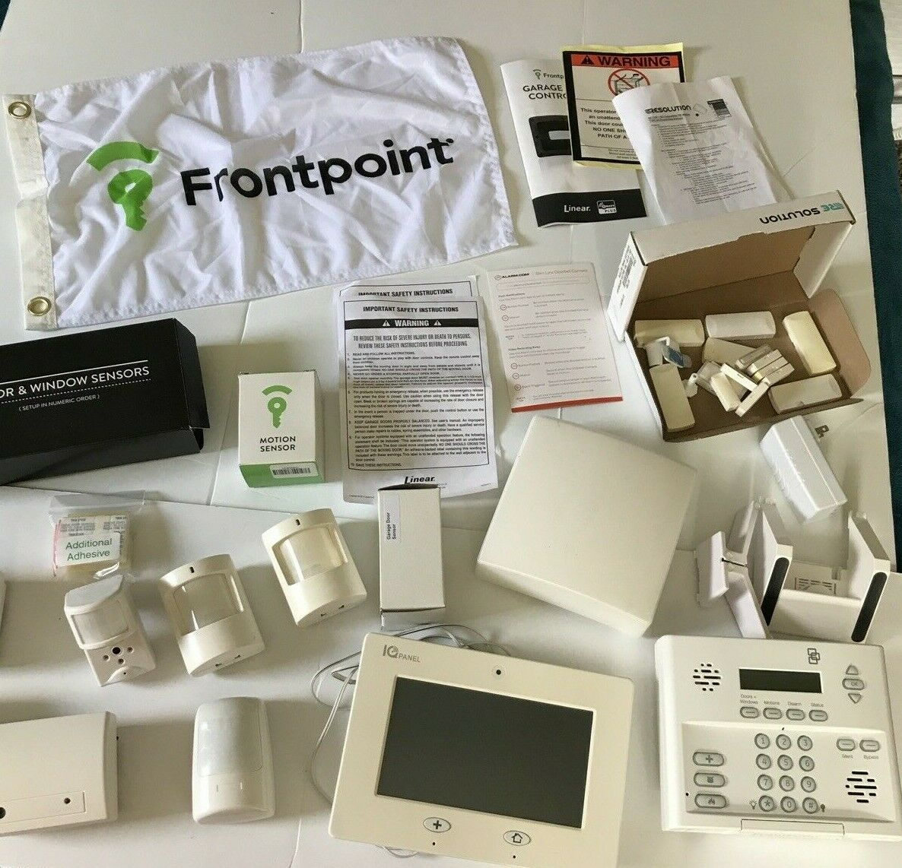

import Overview from "../components/Overview"
import StickyHeader from "../components/StickyHeader"

Do-it-yourself systems are a great way to fully secure your home while saving some money. The best part is that these systems are all wireless, which makes it a lot easier to install on your own versus a wired system. The thing most people don’t like about DIY systems is the upfront cost. You can expect to pay anywhere from $99 up to $399 for your equipment. With this, is the benefit of no contract. All companies that allow you to pay for the equipment upfront don’t require a contract. 

With the popularity of DIY systems growing, the many new options on the market can become overwhelming. I am here to go over the 5 best DIY security systems with you. Each company specializes in something different so I will be sure to highlight who their perfect customer is. This will make it easier to see if they are a good fit for you. I have included some links in which I may receive a commission if you decide to go ahead and purchase something. However, I don’t let that influence my opinion on any of these companies. 

So with that being said! Here are the best do-it-yourself security systems!

<StickyHeader
  title="Frontpoint"
  link="https://www.frontpoint.com"
  id="Frontpoint"
/>

<Overview
  pros={[
    "Best All Around for DIY",
    "Smart home equipment with affordable rate",
    "No Contract",
    "Offers cameras with smart phone app",
  ]}
  cons={[
    "Setting up outside cameras is difficult",
    "not the cheapest DIY option",
  ]}
  price="$44.99 or $49.99 per month plus upfront equipment fees ranging between $99-$479"
  contract="No Contract, you must pay for all equipment upfront"
/>

Frontpoint is the best all around system. They have the widest variety of equipment which makes them a good fit for most people. Their system comes with a touch screen panel, security sensors, and an app on your phone. If you want to, you can add on cameras for inside and outside the home, temperature control, and even automatic door locks. 

The equipment comes from 3rd party manufacturers that can be trusted. They get their products from alarm.com, Qolsys, and skybell. I prefer it when security companies make their own equipment, but this equipment will work well. 

They have great customer service and solid monitoring. Everything I called in, I was able to get a hold of a human being instead of trying to navigate endless menus. Their monitoring is done through the cell phone towers in the area which makes it super reliable. This means that if your landline is cut or if your wifi goes down then you will still have monitoring. 

Their monthly rate starts at $44.99 - $49.99 with no contract if you purchase the equipment upfront. The upfront equipment cost can vary between $99-$399. Their monthly cost is more than some of their competitors. So if cost is your main concern I would not recommend going with Frontpoint. However, if you are looking for a system with all the bells and whistles then Frontpoint would be a great fit!

<StickyHeader
  title="Ring Alarm"
  link="https://shop.ring.com/pages/security-system"
  id="Ring"
/>

<Overview
  pros={[
    "Cheapest Monthly Price",
    "Integrate with Existing Ring Cameras",
    "Affordable equipment",
  ]}
  cons={[
    "Not very many smart home features",
    "High upfront costs",
    "No touchscreen keypad",
  ]}
  price="$9.99 per month plus $199 - $299 upfront for equipment"
  contract="No Contract, just pay upfront for the equipment"
/>

Ring Alarm has the most affordable monthly cost coming in at $9.99 per month. This makes it cheaper than all of its competitors. If you want the cheapest monthly cost then Ring would be the system for you! With the low cost comes basic equipment. Ring does not offer a touchscreen keypad. It is a simple push button keypad that will sit on the wall. Also the security features are pretty limited too. They offer all the basic door/window, motion, and glass breaking sensors. So you can be able to fully secure your home. 

Most people have their doorbell camera already because it is one of the more popular doorbell cameras. For $5 more you can sync the cameras to your app and be able to control the security alarm and cameras in one place. This makes Ring really competitive because they can offer solid security with amazing camera systems. Since you are purchasing the equipment upfront, there is no contact. This means that you can cancel the service anytime you want without penalty. 

Where Ring does not do a good job is with home automation. You will be able to connect some devices such as a door lock, the system was not designed to be a full smart home. Ring is going to be a good fit for anyone who doesn’t care about having the fanciest item out there. Instead their ideal customer would be someone who wants something to work and work well for a low price. I personally recommend Ring out of all the DIY systems because they are the lowest cost and most people who are going for a DIY system really want a low cost. 

<StickyHeader
  title="SimpliSafe"
  link="https://simplisafe.com"
  id="SimpliSafe"
/>

<Overview
  pros={["Low Monthly Cost", "Easy to set up", "Pioneer for DIY system"]}
  cons={[
    "Lack of smart home options",
    "Lack of 3rd party equipment integrations",
  ]}
  price="$14.99 - $24.99 per month plus $183-$299 upfront equipment fees"
  contract="No Contract"
/>

SimpliSafe is the pioneer when it comes to DIY home security systems. They were the ones who paved the way for low monthly costs and no contact options. What I like about SimpliSafe is that they are always improving their equipment line up. Year after year you see new equipment that is coming out that you can add onto your system. 

They offer a traditional push button keypad along with a base station that needs to be in the center of the home. This is what all of your devices connect to. The base station connects to its monitoring station via cell phone towers. This allows for a more reliable connection. They offer all of your basic security equipment. You can find door/window, motion, and glass breaking sensors. They even offer an inside camera and doorbell camera. They do not offer any outside cameras. 

They are pretty limited when it comes to smart home control. You can purchase some 3rd party devices to connect to the system but don’t expect much. For example, the only door lock that is compatible with their system is the August door lock. Another example is that you can connect your Nest thermostat to the system, but you can’t control it from the app. These limitations will not make a good fit for anyone who wants some smart home devices mixed into their system. 

SimpliSafe comes reasonably priced at $14.99 per month for monitoring and $24.99 per month for monitoring and app on your phone. You can expect to pay anywhere from $187-$357 upfront for the equipment. Since you pay upfront for the equipment, you will not have any contract. 

[Check out my full SimpliSafe review](/posts/simplisafe-review)

<StickyHeader title="Cove" link="https://www.covesmart.com/" id="Cove" />

<Overview
  pros={[
    "Low Monthly Cost",
    "Option to not pay upfront in exchange for contract",
    "Great Customer Service",
  ]}
  cons={["No smarthome options avaiable", "No outside cameras"]}
  price="$14.99 - $24.99 per month plus $99-$299 upfront equipment fees"
  contract="No Contract"
/>

Cove is an up and coming company that is getting great reviews. They have great customer service. Anytime you call in, you can expect to be talking to an actual person. They offer a beautiful and easy to use touch screen keypad. This keypad connects to the cell towers just like the others. So if your power goes out or if your wifi goes down you will still have monitoring. 
In addition to a nice keypad, they also offer a door/window, motion, and glass break sensors. 

The downside to Cove is that they only offer one inside camera. They do not offer any outside cameras or smart home devices. This would not make them a good fit for anyone who wants smarthome with their security system. 

The thing that really sets Cove apart is their pricing model. If you purchase all the equipment upfront, your monthly price starts at $14.99 for monitoring and $24.99 for monitoring with app access. The upfront equipment cost starts at $92. With this offer you will be month to month. If you are in a position where you do not want to pay upfront they do offer a 3 year contract option where you do not have to pay upfront. Instead, you just pay a higher monthly payment between $35-$45. 

This solution would be great for someone who needs to get a security system but doesn’t have the money to pay upfront right away. I would recommend this to anyone who is willing to take a chance on a newer company while trying to avoid some of the upfront costs with a DIY system. 

<StickyHeader title="Alder" link="https://www.alder.com/" id="Alder" />

<Overview
  pros={["No large upfront costs", "Will accecpt any credit score"]}
  cons={["No smarthome options", "Bad Customer Service Reviews"]}
  price="$34.99 - $59.99 per month plus $99-$299 upfront equipment fees"
  contract="36 Months"
/>

Alder has gone through changes since it has been in business. They are now focusing on do it yourself systems for no upfront costs. What makes Alder so special is that they will cover the upfront costs regardless of your credit score. This means that even if you have bad credit they will take care of the upfront costs for you. 

They offer the same panel as Cove. It is a touchscreen keypad that connects to an app on your smartphone. The panel works the same way in that they connect it to the cell phone towers as well. You can also expect all of your same security sensors as the other companies. You can have a fully protected home using the sensors that they offer. The main difference is that they are compatible with Arlo cameras. This means that you can get outside cameras for your home unlike with Cove. This feature sets them apart by giving you eyes all around the home. 

Their pricing is more since they are taking care of the upfront costs. They require a $99 activation fee along with a monthly cost of $35-$59 per month. This price is still reasonable if you compare it to other systems that require professional installation, but it is still more than it’s other DIY competitors. The downside to all of this is that they require a 3 year contract. This means that if you cancel during the 3 years, you will have to pay a buy out fee. 

I would recommend Alder to anyone who is in a tight spot with their credit score and doesn’t have money to pay upfront for their equipment. I would also recommend it to anyone who is interested in Cove, but wants outside cameras. 

## Final Thoughts

DIY systems are a great way to save money while securing the home. Hopefully this article can help point you in the right direction for choosing your next home security system. If you want to see my review of all the systems on the market, [you can click here to learn more](/posts/best-home-security-systems). 
