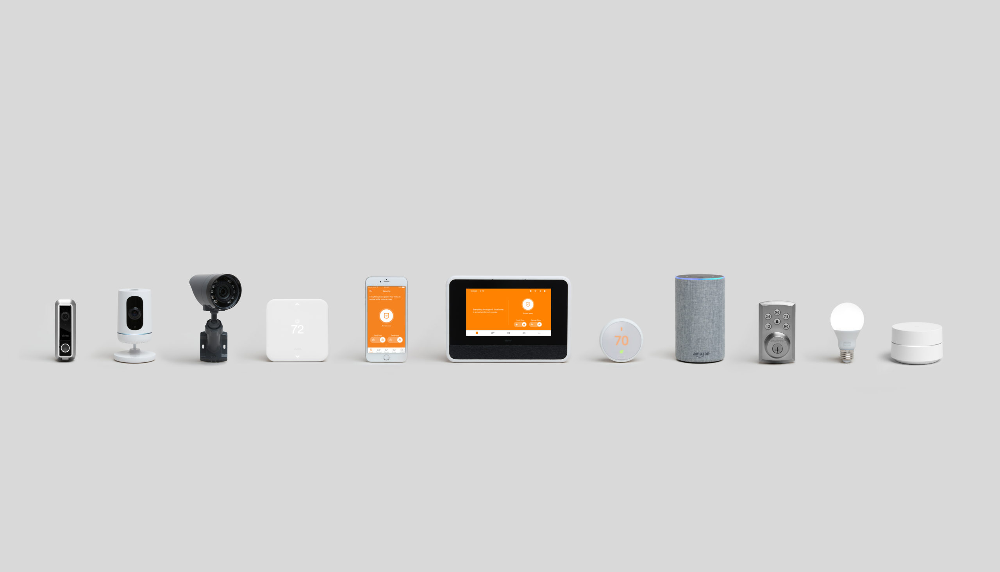

import Overview from "../components/Overview"
import StickyHeader from "../components/StickyHeader"

Look, I get it! Finding the right security system is hard! There are so many options available that it makes it overwhelming to decide. That is why I wrote this article. I have analyzed over 30 different security companies and put together a comprehensive review of each company so you can find the best fit for you. In this article, I review both professionally installed systems and do-it-yourself systems. I even added in a few camera only options. If you find a system that interests you, be sure to click on the link for a more indepth review.
Please note that my work is supported through affiliate commissions, but I don’t let that influence my opinion.

With that being said, here are, what I think are, the best home security systems for 2020.

<StickyHeader title="Vivint" link="https://www.vivint.com" id="Vivint" />

<Overview
  pros={[
    "High Quality Equipment",
    "Wide Variety of Equipment",
    "Best Smart Home System",
  ]}
  cons={["High monthly cost"]}
  price="$29.99 per month up to $99.99"
  contract="Month to month service, you can choose to finance the equipment for up to 60 months"
/>

I put Vivint as my number one recommended because they have such a wide variety of products that they will fit most people’s needs. They have everything from basic security to complete smart home setups. They are considered one of the fastest growing security companies and are winning awards year after year for their innovative equipment. A common trend seen in the industry is when a new product comes out at Vivint then all of their competitors will play catchup.

They offer a beautiful touch screen keypad, easy to use app, and a wide variety of cameras and smart home products. All from the app on your phone, you can turn the alarm on and off, change the temperature of the home, lock and unlock your door, as well as open and close the garage door. What makes them different from their competitors is that they make the majority of their equipment on their own. So all the items work seamlessly together.

Although they don’t have the lowest price, they do have reasonable pricing considering the quality of equipment. For example, if you just want a basic alarm with medical monitoring you are looking at around \$40 per month. This includes monitoring and equipment. Vivint’s priced in a way where you finance the equipment or purchase it all up front. This is beneficial for the customer because it doesn’t require a service contract. If you want to cancel, all you pay is what you owe on the equipment.

I believe that most people will be very happy with Vivint’s quality of equipment and customer service. Their easy to use equipment takes a lot of the headache out of owning an alarm system which is why they are number one on my recommended list.

[Check out Vivint review](/posts/vivint-review)

[Check out Vivint Pricing](/posts/vivint-pricing)

<StickyHeader
  title="Frontpoint"
  link="https://www.frontpoint.com"
  id="Frontpoint"
/>

<Overview
  pros={[
    "Best All Around for DIY",
    "Smart home equipment with affordable rate",
    "No Contract",
    "Offers cameras with smart phone app",
  ]}
  cons={[
    "Setting up outside cameras is difficult",
    "not the cheapest DIY option",
  ]}
  price="\\\$44.99 or \\\$49.99 per month plus upfront equipment fees ranging between \\\\\\$99-\\\\\\$399"
  contract="No Contract, you must pay for all equipment upfront"
/>

I am placing Front Point as my number one recommended DIY security system because of the high quality equipment and the price point. Most people want to save some money when getting their alarm system without sacrificing the quality of equipment. The answer to that is Frontpoint security.

They offer a touch screen keypad, mobile phone app, as well as similar smart home features like Vivint. You can either do a basic system and keep the price cheap or you can go with all the bells and whistles of their smart home options. Most DIY systems are pretty basic. I believe that this is what makes Frontpoint so great, is that you can save money by doing it yourself without having to sacrifice having nice features. The equipment they provide comes from home security manufacturers such as 2Gig and alarm.com which are trusted brands in the industry.

Where Frontpoint really starts to shine is with their customer service. They offer speedy and helpful customer service whenever you call in. If you get stuck when trying to install the system, they offer videos and a customer support line to walk you through it.

Anyone who is set on having a DIY system and wants modern smart home features will love Frontpoint. This is why I have them as my number 1 recommended system for the do it yourself people.

<StickyHeader
  title="Ring Alarm"
  link="https://shop.ring.com/pages/security-system"
  id="Ring"
/>

<Overview
  pros={[
    "Cheapest Monthly Price",
    "Integrate with Existing Ring Cameras",
    "Affordable equipment",
  ]}
  cons={[
    "Not very many smart home features",
    "High upfront costs",
    "No touchscreen keypad",
  ]}
  price="$9.99 per month plus $99 - $299 upfront for equipment"
  contract="No Contract, just pay upfront for the equipment"
/>

Ring has taken the industry by storm with their high quality affordable cameras. Recently they just entered into the home security space with their very affordable home monitoring system. The Ring doorbell camera is the most popular doorbell camera on the market. If you already have it, you can use it along with your security system.

The Ring alarm is a Do-it-yourself system. This means that they will mail you the equipment and you install everything yourself. This will allow you to have a low monthly price because you purchase all the equipment upfront. It is $9.99 per month for cellular based monitoring to police, fire, and medical. The equipment pricing will vary depending on how much you get, but it can be anywhere from $199 to \$399. The best part is that since you purchase all the equipment upfront your service will be month to month. So you can cancel at any time without a penalty.

The install is pretty simple. Most of the sensors have an adhesive that you use to stick on to your door and windows. The system comes with a hub, which is what all the devices will connect to and a traditional push button keypad that most people put by the door.

The downside to Ring alarm is that they do lack a lot of features that are common in other systems. For example, there is no option for a touch screen keypad and it will not connect to your nest thermostat. You can connect the system to z-wave light switches and door locks. So there is the option to have some smart home capabilities.

I would recommend Ring so someone who is looking to have a very affordable alarm set up and doesn’t want to worry about smart home features. If you want a low monthly price with cameras and no contract then I would recommend Ring’s alarm service.

<StickyHeader title="ADT" link="https://adt.com" id="ADT" />

<Overview
  pros={[
    "Equipment Quality Similar to Vivint",
    "Sightly more Affordable than Vivint",
    "Largest and old security company",
  ]}
  cons={["Not top of the line", "Bad reviews for customer service"]}
  price="$45 - $58 per month"
  contract="36 Months"
/>

ADT is currently the oldest and largest security company in the USA. However, their ability to innovate is want makes them still relevant today. ADT offers a variety of old equipment and new equipment. So they are able to reach a wide range of customer bases depending on your needs. They offer equipment that is similar to Vivint’s quality for less. A lot of people don’t need the top of the line equipment. They just need something that is good enough and that doesn’t break the bank account. That is where ADT comes in.

They offer cellular based monitoring, that means there is no need for a landline. You can purchase cameras, door locks, and garage door openers with your system too. They, of course, will offer door and window sensors, motion sensors, as well as glass break detectors.

The downside to ADT is their customer service and contract length. They make you sign a 3 year service contract. There is no month to month contract. However, they will cover the majority of the upfront fees when you sign this contract. ADT does offer a do-it-yourself system that is month to month. You can learn more by clicking here.

[The Complete ADT Review](/posts/adt-review)

[ADT Pricing](/posts/adt-pricing)

<StickyHeader
  title="SimpliSafe"
  link="https://simplisafe.com"
  id="SimpliSafe"
/>

<Overview
  pros={["Low Monthly Cost", "Easy to set up", "Pioneer for DIY system"]}
  cons={[
    "Lack of smart home options",
    "Lack of 3rd party equipment integrations",
  ]}
  price="$14.99 - $24.99 per month plus $99-$299 upfront equipment fees"
  contract="No Contract"
/>

Simplisafe was the pioneer in the industry for low cost products, no contract, and an even lower monthly price. They become well known quickly because there are many people who don’t need all the bells and whistles that most systems nowadays have. They just want something that will alert the police if someone is trying to break in for a low cost.

They are a do it yourself system where you pay for the equipment upfront and pay $15 a month for monitoring. This covers cellular based monitoring which is the safest because it is not dependent on your wifi or landline. If you want access to the app or if you want a camera in your system, then the cost goes up to $24 a month. The upfront equipment cost will vary from $189 - $399 depending on how much equipment you want.

Luckily, they do offer some smart home products, but I would not recommend them if you want a full blown DIY smart home system. They only offer door locks, indoor camera, and a doorbell camera. This is pretty limited compared to other DIY options on the market. They cannot connect to other z-wave products and it will not work with your Amazon Alexa or Google Home.
This system is still a good option for anyone who is renting because there is no drilling needed to set the system up. You simply stick the door and windows sensors up, plugin the panel and hub, and then all in to connect the system to the monitoring station.

I would recommend Simplisafe to anyone who would feel better having some basic security around the house without the heave price tag. I would also recommend it to anyone who only plans on staying in a place for a short amount of time because there is no contract and when you move you can take the equipment with you.

[The Complete SimpliSafe Review](/posts/simplisafe-review)

<StickyHeader title="Cove" link="https://www.covesmart.com/" id="Cove" />

<Overview
  pros={[
    "Low Monthly Cost",
    "Option to not pay upfront in exchange for contract",
    "Great Customer Service",
  ]}
  cons={["No smarthome options avaiable", "No outside cameras"]}
  price="$14.99 - $24.99 per month plus $99-$299 upfront equipment fees"
  contract="No Contract"
/>

Cove is number one in my up and coming list. This is a company that you will want to keep an eye out for because they are offering advanced DIY equipment for very affordable rates.Currently their product selection is limited, but it is growing. What they do offer are touchscreen keypads, inside cameras, along with all the standard door, window, and motion sensors.

At the time of this writing, you can pick up a touchscreen keypad, 3 door sensors, 1 motion sensor, and an inside camera for only $129! That makes them cheaper than SimpliSafe as far as equipment goes. Their monthly rates are also competitive. Their standard plan which covers just monitoring is $15 per month, and their plus plan which gives you access to the app and camera streaming is \$25 per month. Also, there is no contract! Since everything is purchased upfront, you can cancel your monitoring service whenever you want without penalty.

They have not been in business for a very long time, which is why I hesitate to leave them on my recommended list. However, the affordable pricing and praise they have from their current customers makes them an honorable mention and worth checking out if you want to go down the DIY path.

<StickyHeader title="Alder" link="https://www.alder.com/" id="Alder" />

<Overview
  pros={["No large upfront costs", "Will accecpt any credit score"]}
  cons={["No smarthome options", "Bad Customer Service Reviews"]}
  price="$34.99 - $59.99 per month plus $99-$299 upfront equipment fees"
  contract="36 Months"
/>

Alder is another great option for those who want to install it yourself but avoid paying for the upfront costs. They offer basic security plans as well as full home automation plans with no upfront costs except the first month. The best part about Alder is that it doesn't matter what your credit score is. You can have bad credit and still get the system with no large upfront costs. That makes them the only company to offer something like this. They will require a 3 year contract though. This is pretty common for most companies anyways, so it is not a big negative.

Their system comes with a touch screen keypad, outside cameras, as well as all the standard security features that you would expect. The system does come with an app on your smartphone that allows you to be able to control everything. The cameras they offer are from Arlo, which are cameras that I have [recommended before](/posts/best-battery-powered-security-cameras-for-outdoors).

Since they don’t have any upfront costs, the monthly price is a little higher compared to other DIY systems, but still more affordable than other professionally installed systems. Their basic plan starts at $35 per month. This includes only security monitoring and app on the phone. Their next package starts at $50 per month and includes alarm with smart home integration. This means that you can control lights, temperature, and locks from your phone. Finally, their package with cameras and everything else mentioned before starts at \$60 per month. This will give you the ability to stream and watch everything on your smartphone.

This company looks really promising with their new business model. It gives people a chance with low credit scores to buy a security system without the upfront costs. I am leaving on the up and coming list because I want to see how things play out for them over the next few years.

<StickyHeader title="Brinks" link="https://brinkshome.com/" id="Brinks" />

<Overview
  pros={[
    "Offers both DIY and Professional Install",
    "Can work with lots of 3rd party equipment",
  ]}
  cons={["No smarthome options", "Bad Customer Service Reviews"]}
  price="$39.99 - $69.99 options to pay for equipment upfront or roll them into monthly bill"
  contract="No contract if you pay for the equipment upfront, 36 Months for no upfront costs"
/>

Brinks used to be a household name many years ago until they took a hiatus. Now they are back in the market with a new line of products. What makes Brinks interesting is that they offer both DIY systems and professional installation. Depending on what system you order, they will either mail everything out to you and have you install it or they will send a tech to do it for you.

The equipment they offer is modern and easy to use. When I was looking at their equipment, it looks like they go through manufacturers such as Qolsys, 2Gig, and alarm.com. All of these are great manufacturers, but combining so many different parts into one system can make for a clunky experience.

Two out of their three packages are month to month but you must pay for the equipment upfront. Those prices range from $199-$349. Their monthly price is $39. For their top package, which includes an outside camera with professional installation has a 3 year contract and is $70 per month which includes monitoring and equipment.

If you are going to go with Brinks, I would recommend choosing the DIY packages because you can find better deals than the one with professional installation. Their DIY packages have better ability to use other smart home equipment that other DIY packages on the market. So if you want a DIY system with no contract, but also have the ability to tie in other smart home equipment then I would recommend Brinks.

<StickyHeader
  title="Xfinity"
  link="https://www.xfinity.com/learn/home-security"
  id="Xfinity"
/>

<Overview
  pros={[
    "Convenient if you have Xfinity service already",
    "Watch cameras on your tv if you have Xfinity tv",
  ]}
  cons={["Bad Customer Service", "Not very many security features available"]}
  price="$14.99 - $24.99"
  contract="24 month contract or you can pay for everything upfront for no contract"
/>

I am putting Xfinity low on my list because of the quality of their equipment. You can easily spend the same amount on SimpliSafe or Ring and have better equipment. Their camera quality is lower than their competitors and they only offer door/window and motion sensors. There is no glass break, medical pendant, or garage door sensor.

The only time I would recommend Xfinity is if you don’t have a system already and they can offer you a good deal when bundling with your other services. Sometimes if you bundle cable, internet, and security it can be cheaper than just having cable and internet. Other than that I don’t see a good reason to get this system.

This system is better than having nothing. However, if you are going to spend $20 a month and $480 upfront for the equipment you might as well look at other systems out there.

[Read the complete Xfinity Review](/posts/xfinity-review)

<StickyHeader
  title="Protect America"
  link="https://www.protectamerica.com/"
  id="ProtectAmerica"
/>

<Overview
  pros={["Compatiable with lots of 3rd party equipment"]}
  cons={["Average quality equipment with average pricing"]}
  price="$39.99 - $54.99"
  contract="36 months"
/>

I don’t really have anything bad or good to say about Protect America. It is just a standard system with average pricing. There isn’t anything special about their system that makes me want to recommend it. They basically grab a bunch of 3rd party equipment and put it all together. Their system is a DIY system with a 3 year contract. This means that you don’t have to buy all the equipment upfront, but you are stuck in a contract.

Their pricing is also average. It starts at $40 per month for their basic system which gives you 3 door sensors and one motion sensor. Their Silver package is $50 per month which includes 9 door/window sensors and a motion sensor. Finally their Platinum package is \$55 per month which includes 14 door/window sensors and a motion sensor.

For these prices you can easily get [Vivint](/posts/vivint-review) and have more advanced equipment for the same price. Protect America’s system isn’t bad, I just have a hard time justifying the price when you can easily get better equipment for the same rate.
