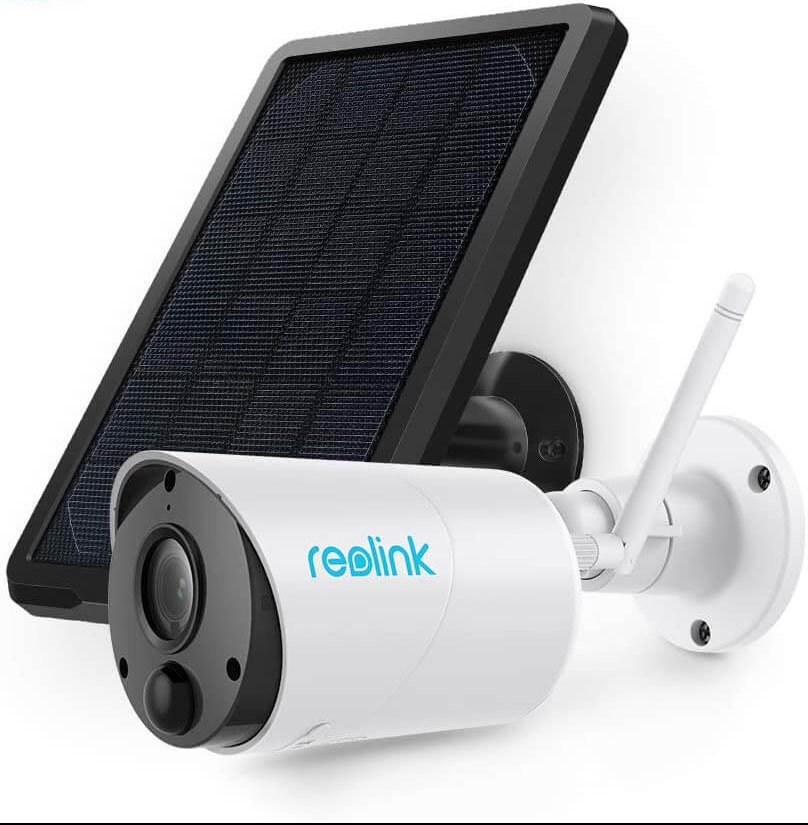
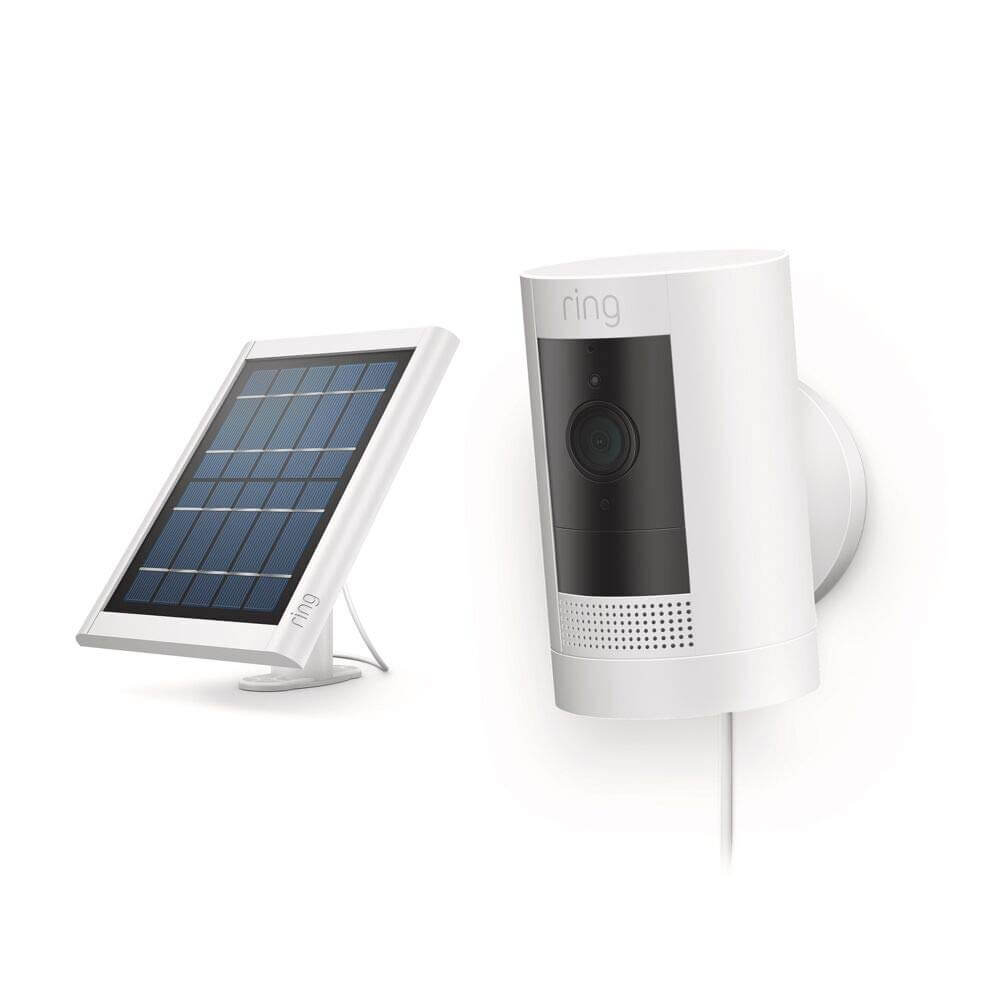

Everyone knows that having outside cameras can help prevent break ins. Plus if a piece of property gets stolen having video footage helps the police try and find the person. The problem with outdoor cameras is having to climb through the attic to properly wire everything. Within the past couple of years, there have been new wireless security cameras that give traditional cameras a run for their money. In this article, I’ll go over the top 5 wireless cameras that run or either batteries or solar panels. All the cameras below have the ability to be able to watch the video in real time from your phone.

## Reo Link go Solar Panel 4g

This camera would be the best option for anyone looking to install a camera in a remote location, or doesn’t want to have to worry about changing batteries out. The camera is powered by a small solar panel that charges the batteries inside. This way you never have to worry about your camera going offline.

The built in cell chip allows for the video to be streamed to your phone **without wifi**. At any moment you can pull out your phone and see what is happening in real time. The night vision lens is also equipped with full 1080p resolution that allows for crystal clear video quality. Also, the motion sensor built inside of the lens will alert you anytime activity is picked up in front of the camera. This option truly is the best for a cabin in the woods, shed, barn, or any other remote location that doesn’t have access to an outlet or wifi.

The built in cell chip allows for the video to be streamed to your phone without wifi. At any moment you can pull out your phone and see what is happening in real time. The night vision lens is also equipped with full 1080p resolution that allows for crystal clear video quality. Also, the motion sensor built inside of the lens will alert you anytime activity is picked up in front of the camera. This option truly is the best for a cabin in the woods, shed, barn, or any other remote location that doesn’t have access to an outlet or wifi.

- Solar powered with batteries
- Uses 4G LTE not wifi
- 1080p resolution
- 2 way voice chat
- App on smartphone
- Night vision
- Weather proof

For more information, you can check out that camera on amazon’s website.

[View packages on Amazon](https://amzn.to/34khsqi)

## Solar powered Ring Stick up Cam

A more affordable option that the Reo Link Go Camera is the Solar Powered Ring Stick up Cam. It also comes equipped with a solar panel that allows for the camera to charge its batteries and work both during the day and at night. This will solve the problem of having to climb a ladder every now and then to recharge the battery.

The downside to this camera is that it connects to wifi instead of 4G cell network. This means that you would not be able to install this on a barn or shed that doesn’t have wifi. However, most people just want to install this on their house. In that case this camera would be a more affordable and great option.

The camera comes equipped with a 1080p lens. This gives you high quality video to see anyone that is coming up to your house. From the app on your phone, you can see what is happening in real time, watch previously recorded clips, and even talk to people through the camera. It comes with two way talk which allows you to have a conversation with whoever is in front of the camera. If you use other Ring cameras for your doorbell or the inside of the home they will all work on the same app which makes things convenient if you already have Ring cameras, or are planning on seeing other parts of the home.

- Solar powered
- Must connect to wifi, no 4G Cell network
- 1080p video
- Night vision
- 2 way talk
- Motion detection alerts to app
- Weather proof

[View Ring Stick up Camera Packages on Amazon](https://amzn.to/3j5cSm1)

## Arlo Outside Battery Powered Cameras

The next camera that I think would suit most people’s needs is the outdoor cameras from arlo. This camera runs on batteries instead of solar. Luckily the battery lasts between 2-3 months until it needs to be recharged. Much like the ReoLink, this camera runs can connect to 4G cell network which means that it does not need wifi. You can stick this camera in a barn or shed no problem.

My favorite part about this camera is the magnetic mount. You stick the mount on the wall and the camera will connect to its base magnetically. You can easily twist the camera around to get the right angle that you are looking for. This seems to be a feature unique to this camera.

The features with this camera are similar to the others. It has full 1080p video, night vision, weather proof, and the ability to save all your video to the cloud. Two way talk and alerts sent to your mobile phone are also available. If you plan on getting arlo, I would recommend looking at their multi camera packages because the cost per camera goes down with the more you buy.

- Battery powered (lasts 2-3 months before recharge)
- 1080p resolution
- Two way talk
- Night vision
- No wifi required, runs off 4G LTE
- Alerts to mobile phone

[Click here to view all arlo camera packages](https://amzn.to/2SoF0Vm)

## Blink Outside Wireless Cameras

Blink is a great option for those who want a good camera for a great price. Blink has the best pricing with the best battery life. The battery life for this camera is two years until it needs new ones. The only catch to this camera is that it needs wifi in order to view the footage live to your phone. So this one would be great for around the home because it can be used outside and inside.

The size of the camera also makes it really discreet and hard to see. This would be a great option to have something hidden around the house. Just because it is small doesn’t mean that it doesn’t have a lot of power. The specs on this camera are similar to the other ones. It also comes with two way talk, 1080p lens, night vision, and is waterproof. You can also expect alerts sent to your phone if motion is detected.

I would recommend this camera to anyone who plans on using the cameras for just around the house and is on a budget.

- Battery powered (lasts 2 years)
- 1080p resolution
- Two way talk
- Night vision
- Wifi is required
- Alerts to mobile phone

[See all packages on Amazon](https://amzn.to/3jsfb2H)

## Eufy Life Outside Camera

The last camera that I would recommend is the 2 outside camera package from Eufy Life. This camera’s battery lasts for up to 180 days before it needs to be recharged. The great thing about this camera is the wide viewing angle. The lens is 135 degree viewing angle. This means that you can see a lot with just one camera!

The mount on this camera also allows for an easy way to change where the camera is pointing to. Once it is installed you can tilt the camera to be able to see exactly what you want. The other specs on this camera are similar to the other ones. It comes with an app on your smartphone, full 1080p resolution, and night vision. Wifi is a requirement for this camera if you want to be able to see remotely from your phone.

- Wifi is required
- 1080p resolution
- Two way talk
- Night vision
- Alerts to app on phone
- 180 day battery life

[See all Eufy Life Camera Packages on Amazon](https://amzn.to/2GpM0yJ)

## Wyze Outdoor Camera

This camera is still in the works but up for preorder. This is why I am making it an honorable mention because when it comes out I believe that many people will enjoy it’s price point. The camera will be available for only \$39! Just because it has a cheap price point don’t think that it doesn’t lack features.

This camera is also 1080p with night vision. You can stream everything to your phone and receive any alerts if someone walks in front of the camera. The camera does require wifi in order to stream video to your phone. There is no option to use 4G LTE. You can still record without wifi to an SD card inside of the camera. However, you will obviously have to go to the camera and pull the card to upload it to your computer. So if you plan on sticking the camera up in a remote location, you can still record video. You just won’t be able to view it in real time.

- \$39 price point
- 1080p resolution
- Wifi required
- SD can be used if no wifi is available
- App on phone with alerts

Hopefully after reading through all of this, you can find a camera that fits your needs. It can be difficult to find a camera for remote locations, but this list is a good starting place. If you are interested in getting a home security system, you can check out my reviews here for sensors that can be placed up on doors and windows.
