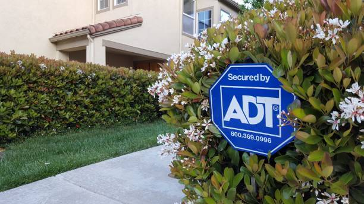

If you just moved into a house that already has an existing ADT system installed then you are in luck! ADT is the largest home security provider in the USA and has been around for over 100 years!

If the house you just bought already has security equipment in it, then you can use that existing equipment and save some money. Let’s cover how to get the system turned on and activated, how to use the equipment without monitoring, and upgrade the system if you want extra features.

## How do I get the system turned on and get a pin code?

In order to get the system turned on, you will need to call in to activate the service. Their phone number is [833-224-7221](tel:18332247221) you can also check out their [website](https://s24alarms.com/YHSE). When you call in, you will speak to a sales rep over the phone that can set up your account and go over pricing. Their monthly price is usually around \$45 per month.

Once you have decided on a plan, they will schedule a time and date to have an installer come over to activate the system. Since you already have the equipment installed, you can avoid a \$200 set up fee. Once the installer reactivates the system, you will be given your pin code and taught how to use it.

From there, you will now be able to successfully turn the alarm on and off.

The only thing you will want to know beforehand is that they will do a 3 year contract even if you already own the equipment. Unfortunately there is no way around this. The only benefit to having the existing equipment inside of the home is that you don’t have to pay for an install fee.

## Can I use ADT equipment without Monitoring?

Yes, You can use ADT equipment without monitoring. The system will still sound the siren even if you are not paying for the service.

If you are able to get the pin code from the previous owners, then you can use the system like normal. This means that you can arm and disarm the system with that pin code.

If you have the system armed and someone were to try and break in, the siren will still sound like normal. Since the alarm is going off, no burglar is going to stick around to see if the cops show up!

The only features you lose out on if you don’t pay are the ability to use the app on your phone and for ADT to call the police if the alarm is triggered. The siren and sensors will still work without monitoring.

If you want to learn more about the ADT service, you can check out my [review here](/posts/adt-review/).

## What if I don’t have the pin and I don’t want monitoring?

Your best bet on getting the pin code, if you don’t already have it, is to reach out to the previous home owner.

If you call ADT, they will not give any pin code out over the phone even if the system is no longer active.

If you can’t get a hold of the previous owner, here are some common pin codes where you might have some luck trying.

You can try..

- 1234
- 2468
- 7923

None of these codes are guaranteed to work. However, they are common pin codes that you can try.

If the system keeps beeping at you, you will need to uninstall the panel or just start up [service](https://s24alarms.com/YHSE).

## How do I upgrade the equipment?

If you want to upgrade equipment, you can do that when you call in at [833-224-7221](tel:18332247221) or visit their [website](https://s24alarms.com/YHSE) to activate the system. ADT has been around for a long time, so chances are that you have older equipment.

Their newest panel is called the command center. It is a touch screen keypad that comes with an app on your phone. You will be able to watch cameras and control devices around the home with it.

Most people are ok with a more traditional system without all the bells and whistles. The only thing that I would recommend is making sure that the system is cellular based. This means that it will call out to the police department using cell towers instead of your landline.

This method of monitoring is the most reliable, because you don’t have to worry about someone cutting the landline on the outside of the home or trying to hack into your wifi.

<iframe
  width="560"
  height="315"
  src="https://www.youtube.com/embed/VlKOD6usMkY"
  frameborder="0"
  allow="accelerometer; autoplay; clipboard-write; encrypted-media; gyroscope; picture-in-picture"
  allowfullscreen
></iframe>

Other than this feature, everything else is just a “nice to have” feature.

If you want a full list of [companies that use cellular](/posts/best-home-security-systems) then you can read my review on the best home security systems.

## I accidentally triggered the alarm, how do I turn it off?

If you set the alarm off by accident then you will want to put in the pin code to turn it off.

If you don’t have the pin code then you will want to unplug the panel and remove the battery.

If you just unplug the panel, the back battery will still power the panel for another 3-4 hours at least. Here are some instructions on how to [replace the battery](https://www.adt.com/help/faq/security-services-features/replace-system-battery). These steps will help you to actually remove the battery.

## Can I use this ADT equipment with another company?

Most ADT equipment can be used with another company. Your panel and any security cameras will not work with other companies. Those will be replaced by the new company. However, any wired sensor that is in the house will work with the following companies.

- Vivint
- Ring
- ADP Security
- Any other local company that uses 2Gig, GE, or Honeywell equipment

Some wireless sensors will not work with these companies. It is always a good idea to call in advance to ask them.

## Final Thoughts

ADT is a really solid sercurity company. They have been around the longest for a reason. Having the equipment gives you an advantage since it will save you money from having to buy all brand new equipment. Be sure to check out their [website](https://s24alarms.com/YHSE) or give them a [call at 833-606-2573](tel:18336062573) for more info.
