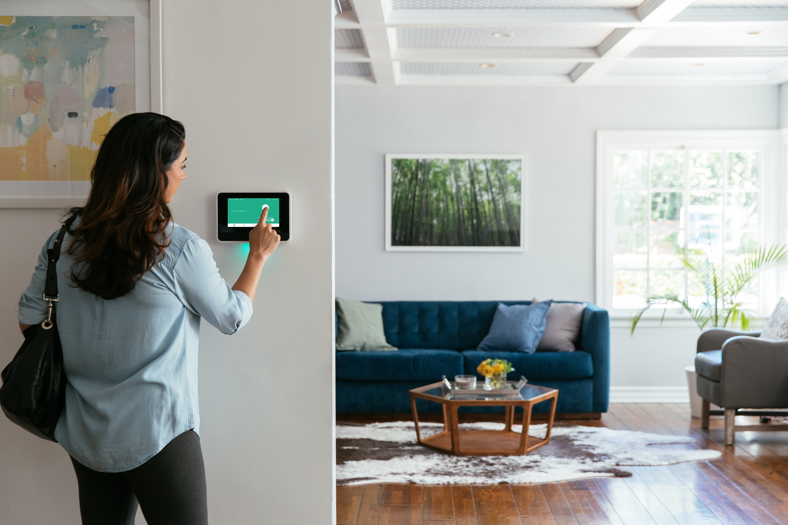
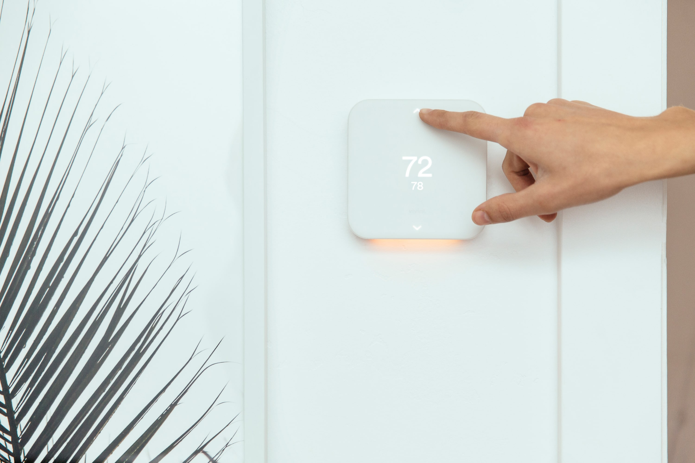
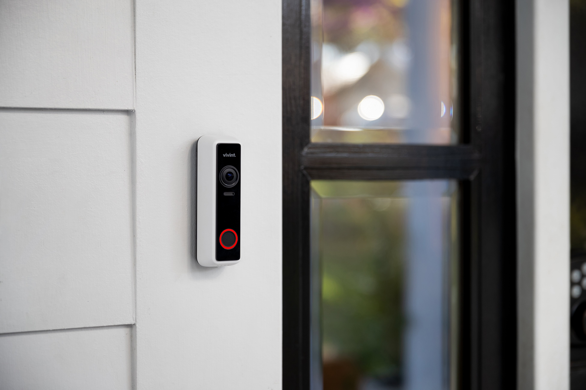

If you just bought a house that already has a Vivint Home Security system then you are in luck! I believe that Vivint is [one of the best security systems](/posts/vivint-review) on the market for most people. Since you already have the equipment in the house that will automatically save you a lot of money since all Vivint customers have to purchase the equipment and pay for a monthly monitoring fee.

My goal of the article is to answer all commonly asked questions about your system. So let’s start with the most common one.

## How do I get the system turned on and get a pin code?

In order to get the system turned on, you will need to call into their sales department and give them the address of your home. They will be able to look up the home in their system and tell you what is in there and how it works. They can also give you a detailed overview of what was installed in there originally.

If you want to move forward and have the system under your name they will schedule a time and date to activate it over the phone remotely. Once on the phone, they will update the software of the panel and set up your 4 digit pin codes etc. You will also be able to set up a username and password to view the app on your phone. This process usually takes about 30 minutes.

If they cannot do it over the phone, then they will send a tech out in person to get the system activated.

## Can I use Vivint equipment without Monitoring

Yes, you can use Vivint equipment without monitoring. However, you cannot use the app on your phone. You can still arm and disarm the alarm, and have it set up to automate things such as a door lock or thermostat whenever you leave. If someone were to try and break in while the system is armed, it will sound the siren but will not call the police.

You will need the 4 digit pin code to arm and disarm the alarm. You can call the previous home owners to ask them what it was. However, if you call Vivint they will not give that info away for obvious reasons. So if you can’t get in contact with the previous home owners, you can call Vivint to activate the system for one month, get a new pin code, and then just cancel the service after that. Their monitoring service is month to month so they will have to give you a pin code once it’s activated, but you can just cancel it after that and the pin code will still work.

## Is the equipment mine to keep?

If you bought the house and the equipment is still in there, then it is yours to keep. If the previous owner failed to move the equipment with them and still owes money on it then they will have to settle it with Vivint. Vivint does not go back for it’s equipment if a person defaults on their payment.

If the customer had notified Vivint before, they would have asked them to move the panel to their new house along with some of the smart home items. Normally Vivint gives them new sensors at the new place.

## How much is the monthly price to just activate it?

Vivint has three different pricing plans. They are $29.99, $39.99, and $49.99 per month. The $29.99 covers basic monitoring to police, fire, and medical. This will also cover the app on your phone. For $39.99 per month, you can have everything that $29.99 covers, but also control any smart home items left behind from the app too. This means that if they have an automatic door lock or thermostat, then you can now control that from the app on your phone. Finally for \$49.99, you can control everything including the cameras. This will give you access to monitor the cameras from your smartphone wherever you are at as long as you have cell phone service.

I do want to point out that their service is month to month. Most companies require a 3 year contract or make you pay hundreds of dollars upfront. If you have Vivint in your home already then you can cancel the service anytime without penalty. This makes it the best deal in the security industry assuming that all the equipment is in there.

## Can I add on extra equipment like cameras?

Yes, you can add on any extra equipment that Vivint offers after the service is activated. They will have you pay upfront for the item and then send a tech out to install it. If you want over \$600 worth of equipment, then you can finance that amount at 0% APR if you qualify. Then they will just roll the monthly bill into your payment kinda of like a cell phone plan.

[I have a complete list their equipment and pricing here](/posts/vivint-pricing/#vivint-equipment-cost)

## I accidentally triggered the alarm, how do I turn it off?

If you accidentally set the alarm off and you don’t have the pin code there isn’t too much you can do. The only thing you can do is to remove the panel from the wall and then remove the back battery. This will get the panel to turn off and shut the siren down. If the system is not being monitored then you don’t have to worry about the police coming.

[Here is a guide to removing the panel and taking out the battery](https://support.vivint.com/s/article/Smart-Hub-Removal-Guide)

You can sometimes try the code **1234** or **2468** to turn the system off because lots of times that is what people leave their code as. It is not a guarantee that it will work though!

## Final Thoughts

I really believe in Vivint’s service and the quality of their equipment. It is exciting to buy a house and already have Vivint installed because most of the work has been done for you! If for whatever reason feel like this isn’t the system for you, [I have an article reviewing the best home security systems out there here](/posts/best-home-security-systems)
