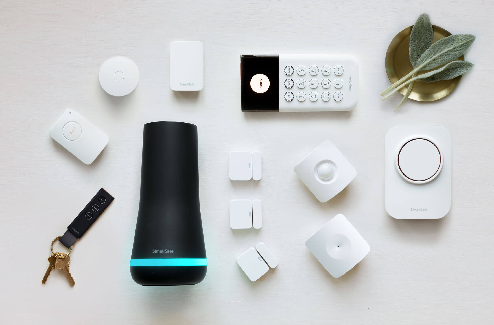

Vivint gives security systems a breath of fresh air with its new innovative tech. Some customers compare it to upgrading from a nokia brick phone to the latest iphone.

So if you already have a security system, you might be wondering if you can utilize some of your existing equipment with Vivint. If it ain’t broke why fix it right?

**Most of the time, Vivint can use your existing equipment. If you have a wired security system they can certainly use it. However, if it is wireless then it depends on what equipment they can use.**

Other things may vary too.

So let’s take a deeper dive into what they can and can’t use.

If you have questions, I always recommend calling in at [833-606-2573](tel:18336062573) or visiting their [website](https://t.vivint.com/?c=1829&lp=159)

## Equipment that Vivint can use

Luckily there is a wide variety of equipment that Vivint can still use to help save you money. My recommendation is to use any existing sensors that you have already. This way you can take that same money you would have spent and buy other cool devices with Vivint.

### Wired security sensors

Nowadays everything is wireless. Back in the day however, all security systems used to be wired. You will know if you have a wired system because there will be a box in a closet or attic that connects to all the sensors in your home.

Assuming all the sensors are still good, Vivint will tie in all of those sensors to its system. So if you have an existing wired system then you should be good to go.

### Some wireless sensors

Some wireless sensors will connect with Vivint while others don’t.

Brands such as 2gig, Honeywell, and GE all work with Vivint. So if you have ADT, Monitronics, Alder, and most local companies use one of these brands.

ADT is the tricky one though. This is because ADT used to use Honeywell equipment, but then switched to DSC which doesn’t work. So in order to verify you can take a look at the sensor and oftentimes it will say the brand.

### Z-wave equipment (Nest thermostat, Amazon Alexa, Philips Hue, etc)

Many new smart home items that run on z-wave will work with Vivint. Here is a quick run down on the main ones.

- Nest thermostat
- Google Home
- Amazon Alexa
- Ecobee thermostat
- Phillips Hue lightbulbs

If you’re wondering if your smart devices will work, feel free to give them a call at [833-606-2573](tel:18336062573) or visit their [website](https://t.vivint.com/?c=1829&lp=159)

## Equipment that Vivint can’t use

Below is a list and quick overview of what Vivint can’t use. Some of these items are the same across the board. For example, ADT can’t use a Vivint keypad. Another example is that Simplisafe can’t use cameras from Ring.

Many companies try to keep technologies proprietary for security reasons and to make more money.

So below I’ll make sure to highlight which things are specific to Vivint and which things are industry wide.

### Panel from another company

Vivint will not be able to use a panel from another company. It comes with its own panel called the skycontrol panel.

This will be true with just about any other company. For example, ADT can use a Simplisafe panel. Almost never, does a security company use the panel from another company.

**Can Vivint install a secondary panel?**

Some people prefer to have a secondary panel in their bedroom or next to the garage door. Vivint does offer a secondary panel. They offer an option non digital traditional rubber button keypad that you can use in another location of the home.

### Different cameras

Unfortunately, Vivint does not use cameras from other companies. This is true for most companies though. It’s rare to see another home security company being able to take over the cameras from a different company.

The only companies that I know of is [ADT](https://s24alarms.com/YHSE) being able to use Ring cameras and some local companies that use 2gig equipment with Alarm.com app.

### Some wireless sensors

Sensors from companies such as protection 1, older Alder systems, and ADT systems that use Honeywell equipment can be used by Vivint.

In other words, the manufacturers of the sensors used by these companies 2gig, Honeywell, and GE work with Vivint.

If the company is using sensors from a brand called DSC then Vivint cannot use that.

Vivint also cannot use any proprietary sensors. So normally you will run into this for DIY systems such as Simplisafe and Ring.

My recommendation is to always try and use as much of your existing equipment as possible. Luckily many of the basic sensors for your doors and a motion sensor come standar already for Vivint.

### All DIY systems (Simplisafe, Ring, etc.)

If you have any existing DIY company such as Simplisafe, none of that equipment will work with Vivint.

This includes Cove, the newer Alder DIY, Simplisafe, and Ring.

Unfortunately, this is true for any other company. For example, if you have Simplisafe and you want to switch to ADT. ADT would not be able to use their equipment.

Many of these DIY companies use their own proprietary equipment. So it makes it almost impossible for another company to use their system.

The only piece of equipment you can use is any z-wave based equipment. So this would include your door lock, thermostat, light switches, and sometimes the garage door opener.

## How to really know

The best way to really know if Vivint can use your existing equipment would be to call in and have a tech come to your home to see it in person.

From there you can review everything in person in order to make a final decision.

If you would like to have tech come out you can call in at [833-606-2573](tel:18336062573) or visit their [website](https://t.vivint.com/?c=1829&lp=159).
