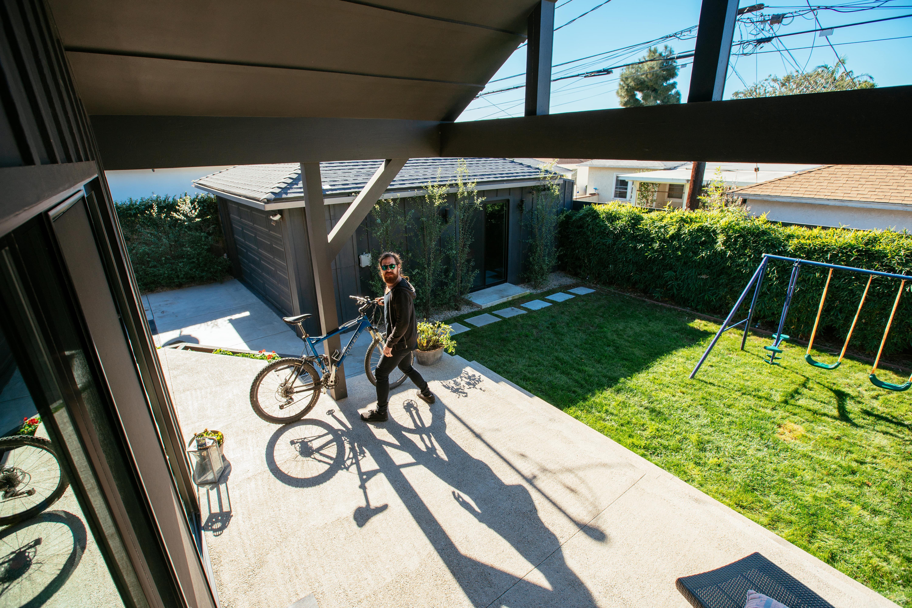

import Overview from "../components/Overview"
import StickyHeader from "../components/StickyHeader"

Security cameras are the best way to catch somebody. If you have a good video, it can be a great piece of evidence to show to the police.

There are many types of cameras on the market now and it can be overwhelming to know which one is right for you. Most people just want to have a few cameras around their house that they can watch remotely. However, for most people, they don’t want to spend the time or money to install cameras.

Let’s review the cheapest way to set up security cameras.

## What is the easiest and cheapest way to install a security camera?

You will want to use a battery powered camera to make the installation cheap and easy. Since you don’t have to run any wires with this type of camera, you can do the install yourself and save a lot of money.

Nowadays, you can purchase battery powered cameras that are weatherproof. In some cameras the battery [lasts up to 2 years.](/posts/best-battery-powered-security-cameras-for-outdoors#blink-outside-camera) This makes installing the camera much easier because you don’t have to run a bunch of wires yourself throughout the attic. You also don’t have to worry about hiring a professional to come out and do it for you.

A wireless camera makes the process so easy that anyone with a screwdriver or drill can set it up themselves.

## DIY vs Hiring a professional

If you hire a professional it can be around $150-$500 to professionally install cameras. Obviously if you do it yourself you won’t have to pay that.

Many people think it can be such a hassle to install outside cameras because they use to all be wired. You would have to drill holes to run wires into the attic to plug the camera in. From there, you would have to run wires throughout the house into a DVR which was plugged into a tv.

This process would take a whole day to have 4-5 cameras installed. With a wireless camera, it can take less than an hour. The cheapest way to set up security cameras is by doing it yourself.

## What are the easiest cameras to install?

There are three cameras that are the easiest to install. Those are cameras from Blink, Ring, and Arlo.

All of these cameras run on batteries, which means that there are no wires. You simply install the mount and attach the camera to the mount. They can be installed within just an hour without any technical knowledge.

These cameras offer long lasting battery life, anywhere from 6 months to 2 years. They even include an app on your smartphone that you can use to watch the cameras remotely.

Let’s go into a deep dive for each one!

<StickyHeader title="Blink" link="https://amzn.to/3jsrpbf" id="Blink" />

<Overview
  pros={[
    "Battery Lasts 2 years",
    "1080p with night vision",
    "Two way talk",
    "App on phone",
  ]}
  cons={[
    "Monthly Subscription to keep recordings past 7 days",
    "Wifi Required",
  ]}
/>

Blink is one of the cameras that I most recommend because the battery lasts 2 years! It is also one of the smallest and most affordable cameras.

The small camera comes packed with features such as high definition video, remote viewing from an app on your phone, and a two way talk feature that allows you to talk to people through the camera from your phone.

This one is extremely easy to install which is why it is one of the [best selling cameras](https://amzn.to/3jsrpbf) on Amazon.

I highly recommend this camera to anyone who wants something high quality without breaking the bank account.

[See all Blink Camera Packages](https://amzn.to/3jsrpbf)

<StickyHeader title="Ring" link="https://amzn.to/2SnFjzD" id="Ring" />

<Overview
  pros={[
    "Ability to attach flood lights",
    "1080p with night vision",
    "Integrate with Ring Alarm",
    "Two way talk",
    "App on phone",
  ]}
  cons={["Wifi Required", "Battery lasts 6 months"]}
/>

Ring is another great option. This camera is also battery powered, which makes for an easy install.

This is a great camera because it has different add ons that other cameras don’t offer. For example, you can [add flood lights](https://amzn.to/2SnFjzD) that will flash whenever motion is detected. They also offer a camera with [a solar panel](https://amzn.to/3j5cSm1) so you never have to worry about changing the battery out again.

Many people have a Ring doorbell camera already, so their outside cameras will work on the same app. They even came out with [an alarm system](/posts/best-DIY-security-systems#Ring) that will alert the police department if someone tries to break into the home. This makes it a great overall camera that will work with just about any type of setup.

<StickyHeader
  title="Arlo Outside Camera"
  link="https://amzn.to/2HOeoLf"
  id="Arlo Outside Camera"
/>

<Overview
  pros={[
    "Watch cameras from app or computer",
    "Weatherproof",
    "1080p and Night Vision",
    "Magnetic Mount",
  ]}
  cons={["Battery only lasts 6 months"]}
/>

Arlo is such a unique camera because the mount for the camera is magnetic. This makes installing the camera even easier because you simply place the camera on the mount and it will stick. You can also easily adjust where the camera is looking by simply grabbing it and shifting it around to what you want to see.

The camera is also jammed packed with great features. It comes with high definition video, two way talk, and night vision. Just like the others, you can use the app on your smartphone to watch everything that is happening in real time.

[See all Arlo Camera Packages](https://amzn.to/2HOeoLf)

## Final Thoughts

Save yourself the hassle of trying to hire a professional to install cameras and use some of the wireless options instead. These cameras are extremely competitive now with affordable pricing. You are interested in adding on more security to the house, you can check out [my articles reviewing the best home security systems here.](/posts/best-home-security-systems)
