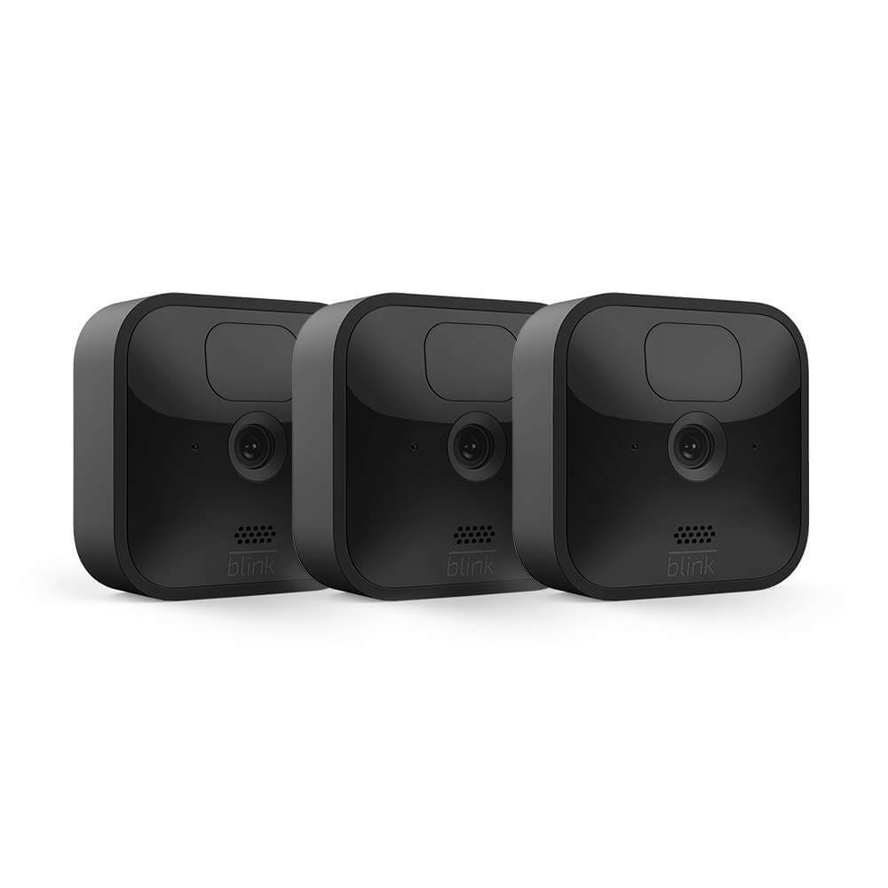

The best way to catch someone snooping around the house is to have a camera outside, set up a neighborhood watch program, or to install a security system.

Anyone of these three methods will increase your chances of catching someone snooping around the house. The camera, in my opinion, is the best option because it is always watching. However, many of us have older neighbors who are always watching the neighborhood which is why starting a neighborhood watch program is also a good idea.

Let’s take a deep dive into each idea.

## 1. Use a wireless camera

The best way to catch someone snooping around the house is with a camera. Cameras nowadays come with an app on your smartphone that you can use to be alerted if someone comes around the house.

Built inside of the lens of a camera is a motion sensor that will alert your smartphone anytime someone walks around the house. They also record too. So if you ever miss a moment then you can go back and watch it on your phone. Nothing is better than some solid video evidence.

Cameras like this are easy to install and are very affordable. The majority of the cameras run on batteries so you don’t have to worry about running any wires around the house. You can set this up yourself without any technical knowledge within an hour.

You can check out my review of the [top 5 wireless cameras here.](/posts/best-battery-powered-security-cameras-for-outdoors)

However, I’ll give you a quick overview of my top 2 below.

## Best and most affordable cameras to purchase

### Blink

The Blink camera is one of my preferred cameras because the battery life lasts up to 2 years! This means you can set it and forget about it for a long time. This also makes install super easy because there is no need to run wires throughout the home. You simply attach the mount to the home and then attach the camera to the mount.

The camera is weatherproof so it can withstand any of the elements outside. The lens is high definition (1080p) and night vision. This allows you to get a crystal clear video even if it is at night.

Blink comes with an app on your phone that will alert you if someone is walking outside of the home. This makes it really easy to catch anyone walking around the outside of the home.

## 2. Start a neighborhood watch program

It’s impossible to watch your house all by yourself 24/7. However, with the help of the neighbors this can make things possible. Everyone wants to live in a safe neighborhood. If someone will break into your house who says that they won’t try to break into your neighbor's house.

A neighborhood watch program can be something as simple as starting a facebook group and reporting any suspicious activity. When you start a program like this, all the neighbors become more aware and are looking for any people they may not recognize in the area.

This way you can have a whole team of people looking after your property and you looking after theirs.

## 3. Set up a home security system

Another great way to catch someone around the house is by setting up a home security system. With a system in place, anyone who tries to get into the home will immediately have the police called on them.

Most people think that security systems are expensive and have long term contracts. However, there are systems for [as little as \$15 per month](/posts/simplisafe-review). There are many systems now where you purchase the equipment upfront so you don’t have a contract. You simply install it yourself by attaching the sensors to the door and windows then connecting the base station to the monitoring department.

Most burglars who see that you have an alarm will just move onto the next house. They are looking for quick and easy. They know that if they open a door and sound the alarm their job just got a lot harder.

## Final Thoughts

Using these tips will help catch anyone from snooping around the house. If you can identify the person that makes it easy for the police to get involved. If you are interested in getting a home alarm system then you can check out my review of [the best home security systems](/posts/best-home-security-systems).
