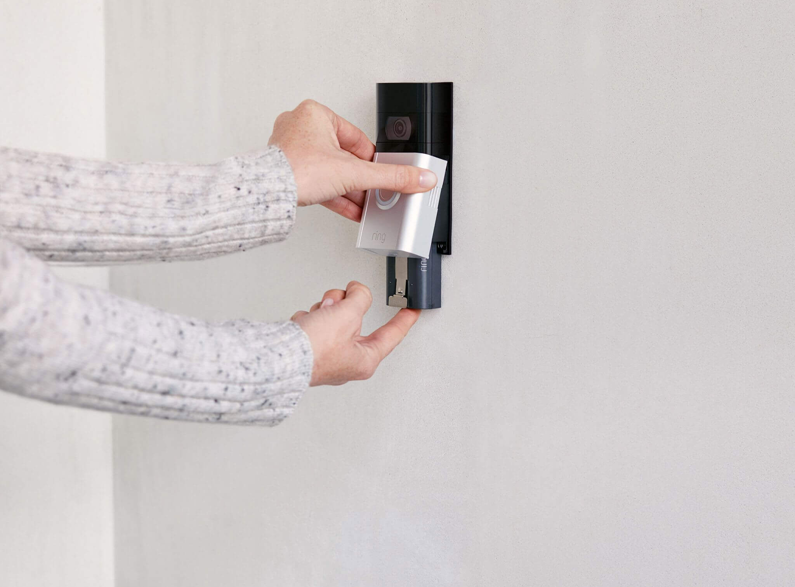

If you have purchased a Ring doorbell and don’t have an existing doorbell, you don’t need to worry. There are still options on the market to do it yourself and not hire an electrician. The options that I will cover here are going to allow you to set up the doorbell camera for under \$15.

## How to Install a Ring Doorbell without a Existing Doorbell

In order to install a ring doorbell camera without an existing doorbell, you will need to purchase a [18 VAC doorbell power supply adapter](https://amzn.to/2GWxa39) that gets plugged into an outlet near the door. You will then drill a tiny hole to run the wires outside and tie them into the base plate.

From there you just follow the instructions like normal for installing the camera.

Here is a quick video of how this youtuber did his.

<iframe
  width="560"
  height="315"
  src="https://www.youtube.com/embed/pW6yZ82t0PM"
  frameborder="0"
  allow="accelerometer; autoplay; clipboard-write; encrypted-media; gyroscope; picture-in-picture"
  allowfullscreen
></iframe>

Here is another good video on how to connect the wires to the doorbell camera itself.

<iframe
  width="560"
  height="315"
  src="https://www.youtube.com/embed/dHV2A3e6Go0"
  frameborder="0"
  allow="accelerometer; autoplay; clipboard-write; encrypted-media; gyroscope; picture-in-picture"
  allowfullscreen
></iframe>

## Voltage Requirements for Ring Doorbell Cameras

### Ring Doorbell 2, 3, and 3 plus

These cameras need a voltage between 8-24 V AC.

### Ring Doorbell pro

This camera needs a voltage between 16-24 V AC.

This is why I recommend [18 VAC doorbell power supply adapter](https://amzn.to/2GWxa39) since it will work on any of these cameras. However, you can use any type of power supply adapter as long as it fits between the recommended voltage.

## Does the Ring doorbell hook up to my existing chime?

If you are hooking up the Ring doorbell to an already wired doorbell, then it will automatically connect to your existing chime. The camera itself will chime, and the chime will play from the box inside this house from that the previous doorbell used. If you don’t have an existing chime there are other options.

## What if I don’t have an existing chime?

If you don’t have an existing chime, there are still several ways that you can have your doorbell chime without using a chime box. The most popular is to buy a Ring chime box that you simply plug into the wall. The other option is if you have a Google Home or Amazon Alexa. Either one of those will connect to the doorbell camera. Finally, you can always have the app alert you on your phone if the doorbell detects someone. Most of us have our phone on us 24/7 anyways.

### Purchase a Ring chime box

<iframe
  width="560"
  height="315"
  src="https://www.youtube.com/embed/c_oCXpE49bI"
  frameborder="0"
  allow="accelerometer; autoplay; clipboard-write; encrypted-media; gyroscope; picture-in-picture"
  allowfullscreen
></iframe>

The easiest way to get a chime if you don’t have a chime box already is to buy one from Ring. You simply plug this device into an outlet and sync it up to the door bell via the app. From the app, you can choose between different sounds that best fits what you are looking for. This is the most affordable option for getting a chime box if you don’t have one already.

[Ring chime box on Amazon](https://amzn.to/3dpPihr)

### Connect the Ring Doorbell to your Google Home or Amazon Alexa

Another option is to connect the Ring doorbell to your Google Home or Amazon Alexa. You can use either one of these to play a chime. This is a great option because many people have one of these devices already. You can simply move the device around the house to make sure that you hear it.

[How to connect Ring to Google Home](https://support.google.com/assistant/thread/16041525?hl=en)

[How to connect Ring to Amazon Alexa](https://support.ring.com/hc/en-us/articles/360031246432-Using-Alexa-to-control-your-Ring-Doorbell-or-camera-)

### Turn on notifications to your phone

The last option is to turn on notifications to your smartphone. Most of us have our phone on us 24/7 anyways. You can receive push notifications anytime the camera is alerted. From there, you can use the app to see who is at the door and even talk to them through it.

## Does the Ring work without a chime?

Yes, the Ring works even without a chime box.

Even if you don’t want to use one of the options above, there is no need to have a chime at all. Although most people would prefer one.

## Final Thoughts

Wiring up the doorbell is a great option to not have to worry about recharging the batteries. Using the techniques above will also help prevent you from having to hire an electrician. For under \$15 you can have the power of the Ring doorbell camera hard wired into the home.
