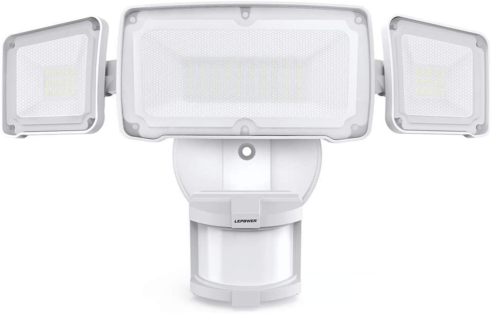
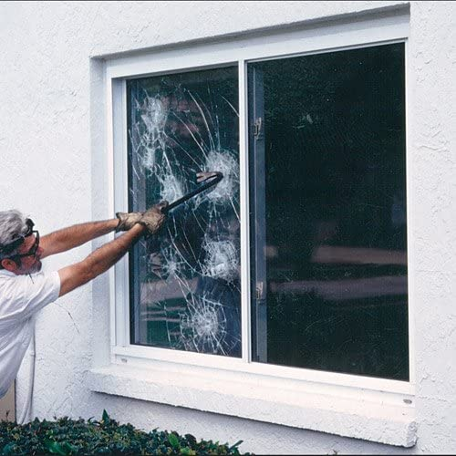
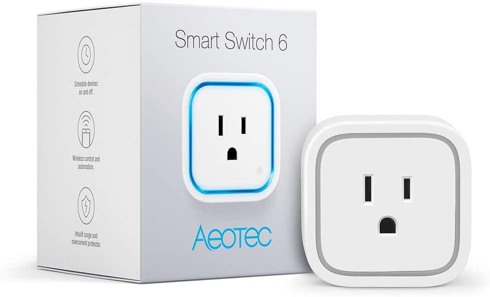

When most people think about securing their home the first thing that comes to mind is getting a home security system. However, that always comes with a monthly bill that many people don’t want to have to pay. There are many ways that get overlooked that don’t require you to pay monthly for. Below are 6 different ways to secure your home **without paying monthly**.

## 1. Outside Security Cameras

The first item on this list is security cameras. These are the best way to deter anyone from breaking inside of the home. Think about it. If you knew you were being filmed, would you do something you are not supposed to?

Security cameras have come a long way and are a lot more affordable nowadays. They even come battery powered so you don’t have to worry about running wires or anything. You simply install the mount and attach the camera.

The cameras that I recommend are [Blink Cameras](https://amzn.to/3jsrpbf). They are the most affordable and have the longest lasting battery life of any other camera. They come with a 2 year battery life! With the Blink Cameras there are **no monthly costs** unless you want to be able to keep 60 days worth of video recording. Right now you get 7 days free.

You can download the app on your smartphone for free and watch the cameras in real time. You can also turn on notifications and be alerted anytime someone walks in front of the camera. Built inside of the camera is a small microphone that allows you to talk to people through the camera from the app. With these cameras, you can always see what is going on around the house no matter where you are at.

[Read Best Wireless Security Cameras](/posts/best-battery-powered-security-cameras-for-outdoors)

## 2. Flood Lights

Flood lights are another great way of protecting the home without an alarm. They are motion activated which means that whenever someone walks in front of the light it will turn the light on. This is a great device to have anywhere it gets dark around the house. The light will expose who is there and deter them from being about to walk around the house without being seen.

Most flood lights are battery powered which makes them easy to install. Some flood lights [even come with cameras](https://amzn.to/2SnFjzD). This would be a simple item to install around the house that will help brighten up the surroundings and deter people away.

[See recommended Flood Lights](https://amzn.to/3jR40k3)

## 3. Strengthen the front door

Most breakins happen at the front door. They get in there because it is quick and easy! There are two things you can do to help secure the front door and make it so people can’t break in.

**Add longer screws where the deadbolt is**

Most people can just kick down the front door with the standard screws that are in the place where your doorknob is. You can replace those with 3 inch screws that will strengthen this part of the door and make it more difficult to break in. This is a simple upgrade that takes just a few minutes to implement and only costs a few dollars.

<iframe
  width="560"
  height="315"
  src="https://www.youtube.com/embed/nOiYyNm92Ws"
  frameborder="0"
  allow="accelerometer; autoplay; clipboard-write; encrypted-media; gyroscope; picture-in-picture"
  allowfullscreen
></iframe>

**Get a lock to prevent lock bumping**

Lock bumping is where someone will buy a key where all the teeth are the same length. They will insert the key into your lock, hit it, and then twist it to open the door all at the same time. This technique allows for someone to break into your home without leaving a mark and it looks unsuspicious at the same time.

<iframe
  width="560"
  height="315"
  src="https://www.youtube.com/embed/hr23tpWX8lM"
  frameborder="0"
  allow="accelerometer; autoplay; clipboard-write; encrypted-media; gyroscope; picture-in-picture"
  allowfullscreen
></iframe>

The best way to defend against this is to get a lock that prevents this. Many locks from Kwikset and yale all have preventative measures to make sure that this doesn’t happen. However, if you have an older lock it may not be ready to defend against this type of attack.

[See Bumplock Resistant Doorlock](https://amzn.to/3dgPsaU)

## 4. Add film to windows

Another simple way that people break into homes is by breaking the window and then crawling through. A rock or hammer does the trick! You can purchase film that keeps the window intact if they were to hit it. This will prevent anyone from being able to break the window and then entering.

To install is pretty simple. First clean your window very well. Then you will peel back the film and stick it onto the windows that you want to protect. I recommend only focusing on the low easy to access windows.

[See Recommended Window Film](https://amzn.to/3djzWeH)

## 5. Make it look like you are home with cheap home automation

Your home is a lot less likely to get broken into if you are there. Most people want to get in and then get out without any witnesses. By using a smart outlet you can connect a lamp into it and turn the lamp on and off remotely to make it look like you are home.

You simply plug the device into the wall, plug in your lamp, and then download the app. Now you can turn the lamp on and off remotely from your phone! This will also help act as a deterrent since it will make it look like you are home.

[See Recommended Outlet Switch](https://amzn.to/3jSz8jb)

## 6. Buy a security sign to make it look like you have one

Lastly, you can buy a security sign from ebay without actually having the system. They cost anywhere from $10 - $20 per sign. You can search “ADT sign” or “Vivint sign” and you will have many options come up.
By having a sign in your front yard it makes it look like you have a system. Most burglars don’t want to have to deal with that so they will typically just leave the house alone. They are wanting quick and easy.
