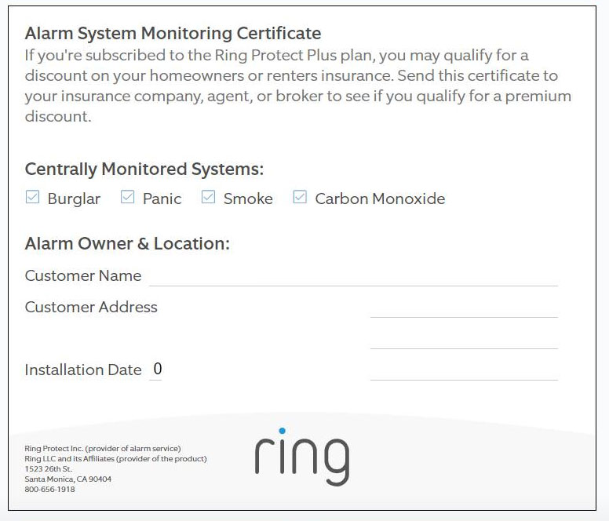

You can download your Ring alarm certificate by going to [ring.com/account](www.ring.com/account). Presenting your certificate is a good way to save money from your homeowners insurance. Although it may not cover the whole bill, it can still be a great way to save some money without much effort.

## How to get your Ring alarm certificate for insurance

In order to get your certificate, you will need to

1. Go to [ring.com/account](www.ring.com/account).
2. Login to your Ring account
3. Click on the icon in the left corner (with the three lines)
4. Then click Location settings
5. Click on monitoring
6. Then click on certificate
7. Finally click on download

Please note that you will need to have the Ring Alarm monitoring service. If you only have Ring cameras, then you will not be eligible to have a discount for your insurance.

## Does Ring Alarm reduce homeowners insurance cost?

Yes, the Ring Alarm can save you up to 20% off your homeowners insurance. The amount will vary depending on the insurance company. However, the system itself will qualify with almost all insurance companies.

In order to maximize your savings, I would recommend incorporating a smoke detector from Ring into the system. The max savings are given when you have both fire and police monitoring.

The good news is that the monitoring cost does not go up when you add a monitored smoke detector. You just pay once for the device itself and the monitoring price will stay the same.

## How much do you actually save with a home security system?

For most companies the savings from insurance is not enough to cover the cost of the system. Ring Alarm is different because it is so cheap coming in at \$10 per month.

You can realistically save about \$24 per month from your homeowners insurance which is enough to cover the bill.

$24 per month is a realistic savings because the average cost of homeowners insurance per year is $1445 or $120 per month. If you save 20% of $1445 that is a total of $289 which breaks down to $24 per month.

## Here is another way to save even more money

The other best way to save money is by adding on a smart thermostat to your security system. In Ring’s case, they are compatible with the [Nest thermostat](https://amzn.to/35hPygn).

The thermostat will automatically adjust the temperature of the home whenever you leave. This will result in savings on your electric bill.

For example, let’s say you leave your house during the summer time and you normally keep your house at 70 degrees. When you leave the house you will arm the system which will tell the thermostat that you are away.

When the thermostat knows that you are away it will increase the temperature of the home by a few degrees so it is not blowing cold air into an empty house.

This increasing temperature will result in a savings of around \$36 per month depending on how much energy you use and how big the house is.

This is a simple and cost effective way to be able to save money along with your security system.
