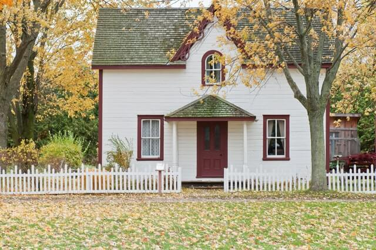
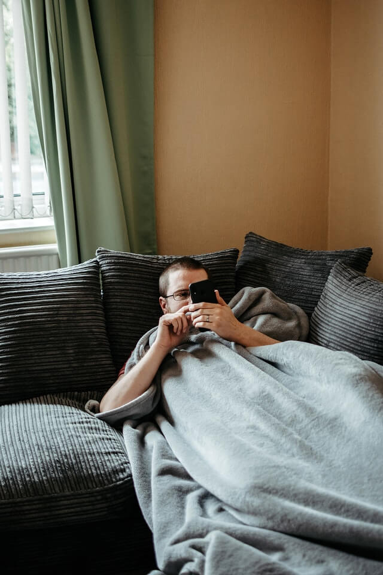

You can know if you are being stalked by your neighbors if you catch them walking through your property, always staring at you, or if they know your routine. It is always an uneasy feeling to know that someone is constantly watching you.
Sometimes you begin to think that you are going crazy. I understand because 1 in 6 women and 1 in 19 ment have been stalked during their lifetime [according to the CDC's National Intimate Partner and Sexual Violence Survey.](https://nij.ojp.gov/topics/articles/overview-stalking) I have listed 7 different signs so you can prove to yourself if your neighbor is really watching your.
If your neighbor is doing some of these things chances are that they really are stalking you.

## How do you know you are being watched?

There are several signs that you know that you are being watched.

1. They know your routine
2. You see them starting over your fence or into your yard
3. They walk through your yard
4. You have evidence that they have tried to break into the home
5. They ask when you will be traveling next
6. They comment and follow you on social media
7. They ask too many questions about your children
   These are all signs that someone may be planning something. Let’s take a deep dive into each one.

## 1.They know your routine

Most of us have a routine. We leave the house at a certain time and come home at a specific time Monday through Friday.
If your neighbor is always standing outside of their home by the time you get home from work, then you know for sure that they understand your routine. They will be outside consistently or looking through their window watching you park your car.
They also make comments about how you came home from work early etc. This is a good sign that they know your routine.

## 2.You see them staring over your fence or into your yard

This one is obvious. If you see them looking over your fence or staring at your yard a lot then you know that your neighbor is watching you. The exception to this rule is if they are outside doing yard work a lot. This can be a seasonal thing.
However, if they sit outside their house or watch your home from a window, then you know for certain that they are spying on you.

### Is it against the law to look over someone's fence?

No it is not against the law unless they are using some sort of telescopic equipment.
They can simply watch you through the fence or sit in their backyard and watch your yard without breaking any laws. If it concerns you then I would recommend bringing it up in casual conversation.

## 3.They ask when you will be traveling next

If you like to go on long vacations, then you will want to make sure your home is prepared. A neighbor who is spying will ask when you are going out of town next through casual conversation.
If they know that you are traveling they may want to try and get into the home while you are gone. [A good home security system](/posts/best-home-security-systems) may be your best bet to prevent anyone from coming inside of the home.

## 4.You have evidence of them going through your yard or home

You may have seen footprints in the snow, or notices that the grass has footprint marks in it. This is a good sign that someone had been on the property and is trying to get a closer look.
You should immediately take pictures of the footprints to try and get a good idea of the shoe size and markings of the bottom of the shoe.

## 5. They comment a lot on your social media

Your neighbor may be following you digitally too. I recommend checking all of your social media profiles to see if your neighbor is following you there.
It would be a good idea to block them if you feel like they are stalking you. On your social media, they can get a good idea if you are out traveling or not. It also may entice them to look through all of your photos which gives them more personal info that they don’t need.

## 6. They ask who else lives with you

Questions about who lives in the home is also a big sign. That is information that they don’t need to know. A normal person should not be directly asking these questions.
They will want to know if you live by yourself, or if you have a whole family that is there with you.
This information is crucial in someone's decision to break into the home. The less people there are the easier it is. The more people the harder it is.

## 7. They make comments about your children

Any comment about your children is not ok. The only time it should be allowed is if they have kids that are around the same age as your kids.
If they ask questions about what sports they play or what their ages are try your best to avoid them. A normal person doesn’t directly ask these questions unless you brought it up first.

## Is it legal for your neighbors to spy on you?

It is not legal for anyone to spy on anyone. If your neighbor is watching you from their house then that is legal. However, if they walk on your property or attempt to place listening devices inside of the home then that is illegal.

## How to make them stop watching you

To make them stop watching you, I would recommend either talking to the police or buying some cameras. There are [many good cameras](/posts/best-battery-powered-security-cameras-for-outdoors) on the market that are affordable and easy to install.
Video evidence is going to be your best bet having the police take action because now they have something to work with.
Let’s go into a deeper dive of other options though.

### Report them to the police

This one should go without saying. If things ever get serious, you can file a restraining order against someone. If they come within a certain amount of feet from you then the police can take them away.
You have to report it though in order for this to happen. Leave a paper trail for yourself. This will make it easier to defend yourself in court if you ever need to.

### Buy a camera

If someone knows they are being filmed they are a lot less likely to act. It will also give you video evidence to show the police if you need to.
I recommend [the Blink Cameras](https://amzn.to/3jsrpbf) because they are wireless, they run off batteries, and they are really affordable. [There are lots of other options though.](/posts/best-battery-powered-security-cameras-for-outdoors)
Video will be a powerful tool you can use to know for sure if your neighbors are actually watching you.

### Vary your routine

Switching up your routine will be a good way to get them off your back. This will cause them to stay away because if you are more unpredictable then they will be more likely to get caught. They will think that you are not home when you actually are.

### Use the Buddy System

If worst comes to worst, you should always buddy up. You should plan and try to be at home when someone else is there.
If you live by yourself, then you can try and find a roommate. Who wouldn’t want some extra help with the mortgage right?
When you have someone else there with you, you will have a witness. A second opinion can help validate any thoughts or feelings that you might be having.

## Final Thoughts

Hopefully these tips help you feel better and can validate any thoughts that you might have if someone is watching you. It can be scary and make you feel uneasy, so be sure to try some of the tips to get them off your back.
