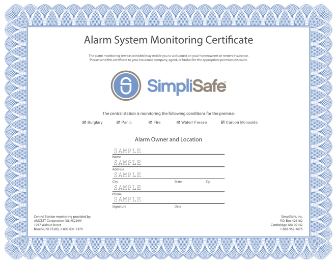

One of the benefits of having a security system that most people don’t know about is being able to get a discount from your homeowners insurance. It is a great way to help offset the cost of having a system. Most of the time it doesn’t actually cover the whole bill. However, since SimpliSafe is so affordable, there might be a chance to offset the cost of the monitoring with the savings that you will get from your homeowners insurance.

## Does SimpliSafe provide an insurance certificate?

Yes, SimpliSafe provides a certificate that you can download to show your insurance company that you have a monitored system. Some companies don’t even need a certificate. They will also accept a receipt from your monthly bill as proof of having a security system.

## How do I get my SimpliSafe alarm Certificate for my insurance?

In order to download your SimpliSafe alarm certificate you will need to follow the steps below.

Login into your account at SimpliSafe.com
In the upper right hand side of the screen find Monitoring Certificate and then click download certificate

Then you will have your certificate! It should look something similar to this.

## Does SimpliSafe reduce homeowners insurance?

Yes, having a security system from SimpliSafe can save you up to 20% off your homeowners insurance. The amount that you will save will vary from company to company. However, a monitored system from SimpliSafe can save you money.

In order to boost the amount of savings that you will receive, I always recommend adding in monitored fire protection with your security service. For most insurance companies, they will increase your savings if you have a monitored smoke detector with the burglar detection in your security system. So if you want to maximize your savings, you should look into adding a smoke detector which will NOT cost anything extra on your monthly price.

## How much can you actually save by giving the certificate to your insurance provider?

You can save up to 20% from your homeowners insurance. The average cost of homeowners insurance in the US is $1,445 per year or $120.41 per month. If you save 20% from that it would be $1,156 or $96.33 per month.

That would save you about \$24 per month just by having the system in your home.For some security companies that would cover the cost of the monthly bill!

## Want to save even more money with your alarm system?

Another great way to save money by owning a security system is to include a smart thermostat with the system. SimpliSafe works with a Nest thermostat. You can install a Nest thermostat and connect it to your alarm.

When you leave your house and arm the alarm it will tell the thermostat to adjust the temperature of the home by a few degrees. For example, if you leave the house in the summer the thermostat will bump up the temperature to 75 degrees so it is not blowing so much cold air into an empty house. Once you come back and disarm the alarm, it will cool the house back to 70 degrees.

Since it is tied to the alarm, it will know when you are home and when you are away. This will help save money on your electric bill every month!

If you have more questions about saving money through your insurance you can check out [this article here.](/posts/insurance-discount-for-home-security-system/)
