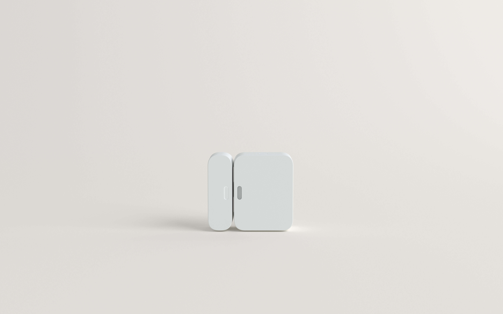

Simplisafe is the first company that comes to mind when I hear someone talk about wanting an affordable home security system. They were the pioneers in DIY home security systems. They came and broke all the rules of long term contracts and high monthly prices that most customers want to avoid. Since they have released their service, there have been many other DIY companies that have popped up. So how does Simplisafe’s service compare to its competitors?

In this review of Simplisafe I will go over all the features, pricing, and quality of service that come with their packages. I’ll discuss how it compares to other companies that offer a similar service and my own personal thoughts and opinions. So with that being said let’s jump into it!

## Panel

**At a glance**

- push button keypad
- base station is the main brain of system
- keyfob available

Simplisafe does not offer any touch screen keypad. Instead they offer a traditional push button keypad that most people place by their front door. The good news is that they do offer an app and a keyfob remote that can be used to turn the alarm on and off. I see most people just using the app because it is way more convenient. The panel is basically just there in case you don't have your phone on you and you need to turn the alarm off.

The main brain of this system is their base station. It is a module that will need to be placed in a center location of the home and it is what all of your devices connect to. The great part about this system is the fact that it is cellular monitoring for its low price. Most cellular based systems that are professional installed cost around $40-$50 per month. Simplisafe on the other hand only costs $15-$25 per month.

Cell based monitoring is the most reliable type of monitoring. Traditionally, alarms systems used to be connected through your landline phone. However, burglars found that by cutting the phone wire from the outside of the house that the alarm system would never call out. So the police would never be notified. With a cell based system, such as Simplisafe, it doesn’t matter if your landline is cut or if you wifi and power goes out. The system will still work because it doesn’t rely on that. This is why I always recommend using a cell based system such as theirs.

## Mobile App

**At a glance**

- \$24 per month with mobile app
- Watch cameras, arm and disarm the alarm, lock and unlock your door
- App works well and is a smooth experience

When you think of a low price, you normally think of low quality. This was not the case with the Simplisafe app. The Simplisafe app was surprisingly easy to use. It has a clean interface and big buttons which makes it easy to click on them. It is important to note that the app does cost extra and brings the monthly price to \$24.99 per month.

From the app you will be able to lock and unlock your doors, turn the alarm system on and off, and even watch your cameras. To my surprise, it worked very well. The alerts are always a nice feature too. You can be alerted if someone turns the alarm off or if the camera detects someone at the door. It is a nice sense of security to know what is going on around the home while you are away.

If you have someone in the home who does not want to use the app, you can purchase a keyfob for them. This way they can simply push one button to turn it on and one button to turn it off.

The only features I see lacking from this app is found in the ADT app. That is the ability to be able to pay or bill and order a new sign. This of course is just an extra benefit that is not a must have.

## Cameras

**Doorbell camera**

The doorbell camera from Simplisafe is a great choice for anyone who wants to keep all their equipment within the same system. You can find doorbell cameras that are cheaper than theirs, but it will not work with their app. All things considered, the price of \$169 is a very fair price for a doorbell camera when looking at the specs.

The camera lens is equipped with a 1080p lens. This will give you crystal clear video quality of anyone walking up to the door. Inside of the lens is a motion sensor which will detect anyone approaching the home. This means that even if they don’t ring the doorbell that you can still be notified. The camera lens is not as wide as other lenses when looking at doorbell cameras. This one comes with a 162 degree lens instead of 180. For most homes that will be good enough.

Two way talk is enabled on their camera. Using the app on your phone, you can talk to people through the camera and make it look like you are home even if you are away. This will give you the ability to have conversations with people at the door.

The camera will do livestream and will record whenever there is motion detected. Included in the pro plan is the ability to save all of the recordings to your computer that you can keep if you want. So you do not need to worry about paying more in order to keep the video recordings.

**Do I need an existing doorbell in order to install their doorbell camera?**

You do not need an existing doorbell to install their camera although it would be easier. Instead, you can buy a 8-24VAC adapter that gets plugged into an outlet to power the camera. You would then need to find a way to get the wiring to the door where you want the camera.

**Is wifi required for the doorbell camera?**
Yes, wifi is required in order to stream the video.

Can I use only the doorbell camera? Or do I have to have the security system with it?
Many companies will make you purchase their security service if you want their camera. Simplisafe does offer a camera only option where you can purchase the simplisafe camera and pay $4.99 per month for the app along with video recording. If you want a second camera, then it is $9.99 per month.

## Smart Home Features

**SimpliSafe Doorlock**
The only smart home device that SimpliSafe offers is their [automatic door lock](https://amzn.to/33wDFlT). This feature gives you the ability to lock and unlock the door from your phone. Also, if you ever lose your key can just plug in a code on the keypad to unlock the door. The door lock itself is very slim and clean compared to other door locks. It runs off batteries that will need to be changed out about every 3 months with normal use.

This is a great feature to have because if you ever leave the house and forget to lock the door, you can just do it from your phone. You can also set up alerts to the app on your smartphone so if the door is unlocked you can be notified. This comes in handy if you are wanting to know when people are coming in and out of the house.

The downside to this door lock is there is no keyhole which you will find on the [kwikset doorlocks](https://amzn.to/3iuH8W9). This door lock is compatible with almost all security systems. This makes it difficult if the battery runs out because there would be no other way to unlock the door.

**Can I use just the door lock?**

The door lock from SimpliSafe is not a stand alone door lock unlike the one from kwikset. You will need a system from SimpliSafe for it to work.

## Integrations

Just because SimpliSafe offers only one smart home device does not mean it isn’t compatible with other devices on the market. While you may not be able to do a full blown smart home system like with [Vivint](/posts/vivint-review), you can add on a few extra features to make it more robust.

**August Door Lock**

If you don’t want to buy a smart lock from SimpliSafe, you can use the [August door lock](https://amzn.to/36BCbIC). I would recommend this since this device is stand alone. That means that if you choose to get rid of SimpliSafe, you can still use the door lock with it’s app.

**Nest Thermostat**

Most people have a [Nest Thermostat](https://amzn.to/34lhwpI) nowadays. If you don’t, I always recommend getting one because of the savings that you will receive from your electric bill. **You will not be able to control the thermostat from your app**, but you can tie the system with the thermostat so it will adjust the temperature of the home whenever you arm the system.

**Google Home and Amazon Alexa**

You can sync up your Google Home or Amazon Alexa to your SimpliSafe system. All that this will allow you to do is arm your system with your voice. It is important to note that you cannot disarm your system with either device. You don’t want someone from the outside to yell “hey alexa! Disarm my SimpliSafe system”.

## Security Features

**At a glance**

- Offers all standard security features
- Has equipment for police, fire, and medical

SimpliSafe offers all the standard security features that you would come to expect. You can buy door and window sensors, glass break and motion sensors, flood sensors, and even panic pendants. You can get a smoke detector that ties into the system allowing for the fire department to be called if the home is on fire.

SimpliSafe does a great job at covering all of the basic security features needed to protect your home. Some other DIY systems, suchs as [Xfinity Home Security](/posts/xfinity-review), only offer door and motion sensors.

## Can SimpliSafe use My Existing Equipment?

**At a glance**

- SimpliSafe cannot use equipment from other companies
- Other companies cannot use SimpliSafe’s equipment

SimplieSafe cannot use equipment from other companies. You can only use equipment from SimpliSafe with their system. This can be a downside to many people who already have security equipment in their home. Companies such as [Vivint](/posts/vivint-review) and [ADT](/posts/adt-review) can use equipment from other companies. This is a common problem with any DIY system. The majority of them cannot use equipment from other companies whether that be wired or wireless.

## Monitoring

**At a glance**

- Cellular based monitoring
- Does not use landline or wifi

All the monitoring is done through the cell towers with SimpiSafe. This means that you do not need a landline or wifi for the system to work. It works by using a cell chip inside of the base station that uses the cell phone towers in your area to call their monitoring station. I always recommend using a cell base system because if someone were to cut your landline, or try and hack into your wifi, you will still have monitoring. **This type of monitoring is the most reliable the you can get on the market**.

## Customer Service

**At a glance**

- Only open from 8AM-Midnight EST
- Mixed complaints/reviews

There are some mixed reviews on SimpiSafe’s customer service. I want to note that their customer service department is not open 24/7 like it is with other companies. Instead, it is open from 8AM - midnight EST. For most people this will work, but if something is going wrong in the middle of the night you will have to wait before you get ahold of somebody. The biggest complaint is that it takes time to get ahold of someone and when you do, you hope that they know what they are talking about.

## Installation

The install is all done by yourself. It is surprisingly easy to set up and takes about an hour tops. The first thing you will set up is the base station. This is the main brain of the whole system. You will simply plug it in and all the other devices will connect to it.

All of the sensors including the panel, are mounted by using the provided sticky tape. You simply peel off the back and stick it onto a door, wall, or window. The sensors do a good job of staying on with normal use.

## Pricing

Simplisafe’s cost is $14.99 per month for monitoring and $24.99 per month for monitoring and smart phone access. The upfront equipment cost varies from $180-$300.

[See all packages}(https://amzn.to/2Sl9ese)

This price is more than the Ring alarm system by \$5 for their basic plan. However, compared to other systems such as Brinks or Xfinity this system is really affordable. The upfront equipment cost is fair along with the monthly price. When you compare it to other companies such as Vivint or ADT you can save hundreds every year.

## Contract

**At a glance**

- no contract
- cancel anytime without penalty

SimpliSafe is month to month. There is no contact whatsoever. This means that you can cancel the service at any time without penalty. The downside to this is that you have to pay for the equipment upfront. This can be anywhere from $100-$300 upfront. This makes it a perfect fit for anyone who doesn't plan on having security in a year or two from now or just doesn’t like to have financial obligations.

Since you pay for the equipment upfront, there is no credit check. You can have the worst credit ever and still get SimpliSafe. However, you will need to pay for the cost of the equipment upfront.

## Who is SimpliSafe for?

SimpliSafe is for anyone who wants a solid security system for a decent price. This would be a great fit for any renter who won’t stay in their place for very long. This would be a great fit for someone who lives in a quiet neighborhood, but wants a little piece of mind. If you are the family that travels a few times a year and would like to only have monitoring during the months that you are gone then this would be a great fit. I would not recommend SimpliSafe if you live in a neighborhood that has frequent break ins. You will want something more robust with better camera quality.

## Final Thoughts

SimpliSafe is a great choice for DIY security. Their sleek aesthetics make for a great addition to the home without it being an eyesore. Although other companies might be a few dollars cheaper, it is still way more affordable than other DIY systems and even more affordable than professionally installed systems. All in all I would recommend SimpliSafe for a great DIY experience.
