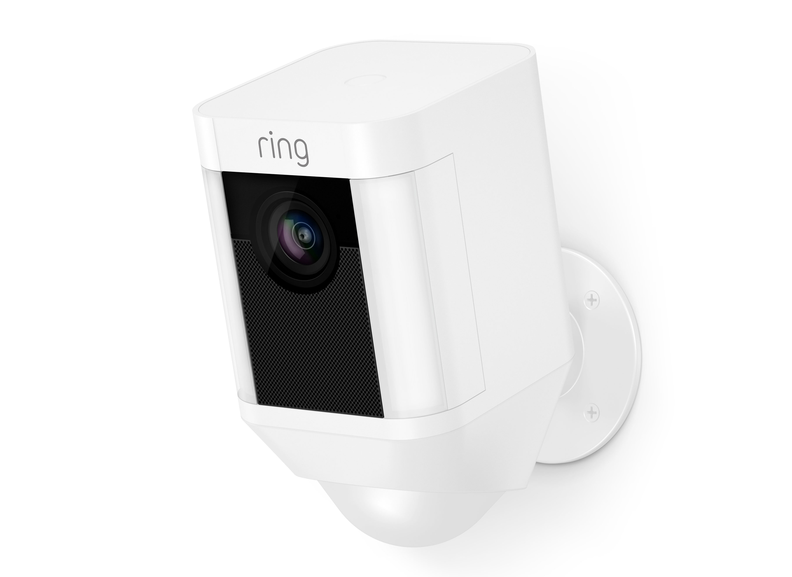
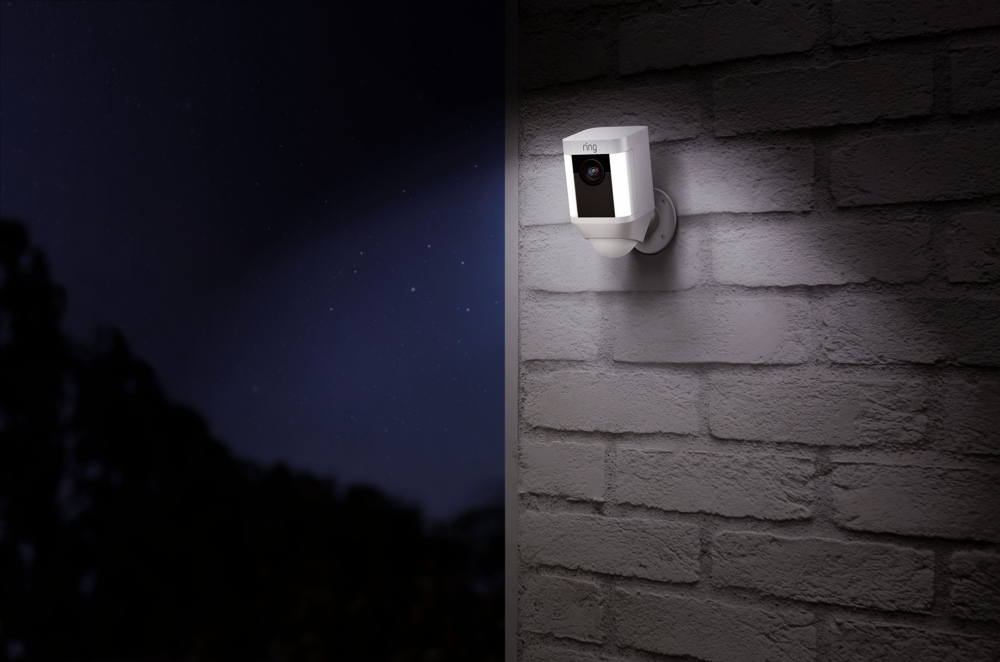

import Overview from "../components/Overview"
import StickyHeader from "../components/StickyHeader"

The best security cameras without a power supply are going to be the Blink, Eufy, and Ring cameras. All of these cameras run off batteries and don’t need to be plugged into an electrical outlet. This makes the install super easy! You no longer have to drill holes from the outside of your home and run wires to the inside.

In this article, I am going to cover all three of these cameras and include all the details that you will want to know about each one of them. Below are links to these products on Amazon and I do make a small commission if you use that link to purchase any of these devices, but I don’t let that influence my opinion about any of them.

## Can security cameras work without electricity?

All cameras will need some sort of electricity to have the cameras work. However, this can be done through a long lasting battery that gets installed in the camera instead of having to plug the camera into an outlet.

When the camera has to be plugged in, it makes for the installation to become very difficult. However, if you can simply install a mount and latch the camera onto the mount the install will be much faster.

<StickyHeader title="Blink" link="https://amzn.to/3jsrpbf" id="Blink" />

<Overview
  pros={[
    "Battery Lasts 2 years",
    "1080p with night vision",
    "Two way talk",
    "App on phone",
  ]}
  cons={[
    "Monthly Subscription to keep recordings past 7 days",
    "Wifi Required",
  ]}
/>

The Blink cameras are going to be the smallest, most affordable, and have the longest lasting battery. This is why I am putting them number one on this list. The **battery lasts up to two years** before it needs to be recharged!

You can install it very easy by placing the mount on the outside of the home and then attaching the camera to the mount. You do not need to drill any holes into the wall to pass a wire through.

The camera itself is very high quality despite how affordable it is. The camera lens is a full 1080p with night vision. It comes with an app that you can download to watch everything happen in real time. So you can be anywhere in the world and watch this camera from your phone or computer. If you ever miss a moment, the motion sensor built inside of the lens will send you alerts to your phone when someone is approaching the home. This way you can pull out your phone and catch what is happening.

It is important to note that this camera does require wifi if you want to stream and record. If you need a camera that doesn’t require wifi, you can [check out this post here](/posts/best-wireless-security-cameras-for-outdoors/).

[See All Blink Camera Packages](https://amzn.to/3jsfb2H)

<StickyHeader title="Eufy" link="https://amzn.to/2GC1gbO" id="Eufy" />

<Overview
  pros={[
    "Battery Lasts 1 year",
    "1080p with night vision",
    "Local Storage option",
    "Two way talk",
    "App on phone",
  ]}
  cons={["Wifi Required"]}
/>

The Eufy cameras are great because they also run on batteries. That means that you don’t need you don’t need to drill holes from the outside of the home to run wires to the inside. You simply install the mount and attach the camera on there.

The battery lasts 365 days. This makes it one of the longest lasting batteries on the market. In addition to a long lasting battery, this camera also comes with it’s own DVR for local storage. This way you don’t have to worry about paying a monthly price for video storage.

The camera comes with similar features like the Blink camera. The lens is a full 1080p with night vision. This makes for a crystal clear video when you stream. There is a two way talk feature that gives you the ability to communicate with whoever is at your door. You can also go back and view any of the recordings that you miss through their dvr. This way you never have to worry about missing a moment.

[See All Eufy Camera Packages](https://amzn.to/2GC1gbO)

<StickyHeader title="Ring" link="https://amzn.to/2SnFjzD" id="Ring" />

<Overview
  pros={[
    "Ability to attach flood lights",
    "1080p with night vision",
    "Integrate with Ring Alarm",
    "Two way talk",
    "App on phone",
  ]}
  cons={["Wifi Required", "Battery lasts 6 months"]}
/>

Ring has become extremely popular recently because of its famous doorbell camera. Since then they have extended their products to other outside cameras as well as an [alarm system](/posts/best-DIY-security-systems). The Ring Stick up camera comes with a battery that lasts up to 6 months before it needs to be recharged. This makes it a truly wireless camera.

The camera quality is excellent. Just like the others, it comes with a 1080p lens and it has night vision. Built inside of the camera is a microphone that allows for two way talk. Ring offers free recordings of anything that happens in front of the camera for up to 7 days. Any recording after that, you will need to pay to expand the recording capacity.

The best part about this camera is all of the add ons. You can add on flood lights to this camera and even connect it to their Ring alarm system if you have it. This allows for additional security to be added on that the other companies don’t offer. The only downside to this camera is the pricing and how long the battery lasts. 6 month battery life is pretty short when compared to the other cameras. Compared to other battery powered cameras it isn’t the worse either. I have seen some other cameras that last only 2 months!

I would recommend this camera to anyone who wants to add a security system to their whole set up. That way you can have everything under one system.

## Do all outdoor security cameras have to be plugged in?

No, you can power a camera through batteries.

## How long do battery powered security cameras last?

A battery inside an outside camera can last between 6 months - 2 years.

Hopefully this helped you find the camera system that you were looking for! I understand that there are many options on the market so I wanted to narrow it down to the top three cameras that I think are best. If you are interested in adding on a security system with your camera options, you can [check out this other article](/posts/best-home-security-systems).
