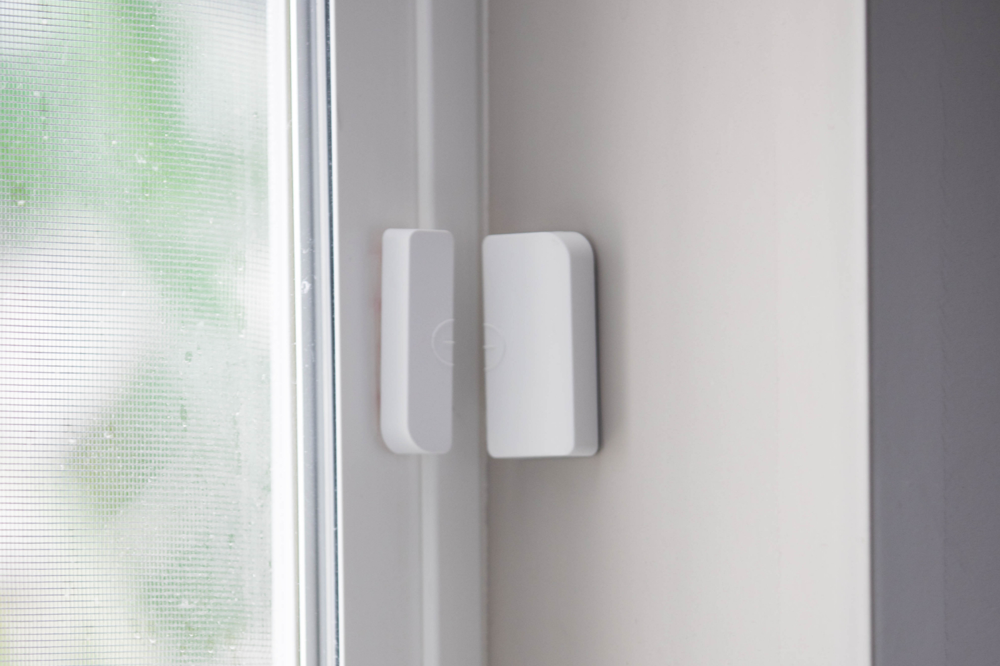

If you are new to the security world, things can seem really daunting because there are so many different options in home security. The last thing you want to do is order a system that you don’t like and not have any way to return it. Some basic knowledge beforehand can make a huge difference in knowing what you need and don’t need in your system. In this article, I am going to cover the top 5 best home security features that you need.

## What should I look for in a security system?

When looking for a security system, you will want to have the following features.

1. Cellular based monitoring
2. Two way voice
3. Smartphone app
4. Crash and Bash
5. Flexible Equipment

All of these features are common for most systems. However, not all security companies give all 5 away. Let’s break down each one for more details.

## Cellular based monitoring

Cellular based monitoring means that your system will use the cell phone towers to call your monitoring department. Just like how your cell phone has a sim card in it, a security panel will work the same way.

This is such an important feature because if your landline gets cut, power goes out, or even if your wifi goes down you will still have monitoring. **This makes cellular based monitoring is the most reliable type of home security monitoring.**

Before cellular based monitoring, home security systems used to use your landline. Some companies to this day even offer it still! The problem with it is that a burglar can cut the landline from the outside of the home and the alarm system will never call out!

However, with cellular based monitoring, even if this were to happen you will still have monitoring.

## Types of Home Security Systems

There are about three different types of systems on the market nowadays that you should be aware of. When I say type of system, I am really saying how it is monitored.

There is

1. Landline
2. Wifi
3. Cellular based

An alarm company will use one of the three or sometimes a combination of some of them to have the alarm call out to the police department if the alarm were to be triggered.

When alarms first came out they used to use your landline to call out to the police department. The alarm was literally making a phone call just your phone did back then. Later people discovered that the landline could be cut and the system would never call out. I would not recommend using a landline based system.

The second type is wifi based. This one simply uses your wifi to call out to call out to your monitoring station. This type is also unreliable because if the power goes out normally your wifi goes out too. Also wifi is vulnerable and can be hacked very easily.

The last option is cellular based monitoring. As I mentioned before, this type of monitoring goes through the cell towers. If your power goes out, wifi goes out, or if your landline gets cut, you will still have monitoring. It simply uses a sim card to call out just like your cell phone does.

I always recommend cellular based monitoring.

## Two Way Voice

Two way voice is a feature where someone from the monitoring department can talk to you through the panel itself. It’s kind of like having them on speakerphone after the alarm goes off.

This feature works when the alarm is triggered, someone from the monitoring station will try and talk to you through the speaker on the panel. You can also talk back to them.

This is an important feature to have because if you are inside of the house while the break in is happening, you may not be in a position to answer your phone. If the agent comes on through the speaker and hears people running around and yelling then they know to send the police.

Two way voice will make the response time faster and can also help prevent false alarms. If you accidentally set the alarm off, you can just tell them through the speaker. This will help prevent the police from showing up to your house without you wanting them too.

## Smartphone App

A smartphone app is almost a must nowadays. There will be many times where you wonder if you remembered to set your alarm before you left the house. With an app on your phone, you will be able to see if the system is armed or not remotely.

So using the app you will be able to turn the alarm on and off anywhere you are at. This makes using the alarm a lot more convenient.

## Crash and Bash

<iframe
  width="560"
  height="315"
  src="https://www.youtube.com/embed/uj_8dm51giw"
  frameborder="0"
  allow="accelerometer; autoplay; clipboard-write; encrypted-media; gyroscope; picture-in-picture"
  allowfullscreen
></iframe>

A common way to make sure that an alarm doesn’t call out is to run inside and rip the panel from the wall. This would make sure that it doesn’t call the monitoring department before the siren goes off.

If your panel is anti crash and bash, it means that if someone breaks the panel with a baseball bat that the panel will lose connection and this loss of connection will alert the monitoring station.

This is a common feature in most systems, but not all systems offer it. It is always a good idea to double check to see if this is available with your next home security provider.

## Flexible Equipment

The last thing you will want to look for is how flexible is the equipment. Flexible equipment means **what other companies can use this equipment if I decide to switch providers.**

Some companies, such as SimpliSafe and Xfinity, have equipment that is exclusive to only their systems. So if you have SimpliSafe and want to change to ADT then you will have to buy all new sensors.

On the other hand, if you have ADT and want to switch to Vivint they will most likely be able to use all the sensors and smart home items.

If you have a system that can be used by other companies, this gives you more options down the road if you decide to change companies. It will also save you a lot of money in the long run.

Some items no matter what are not going to be flexible. For example, panels are pre programmed for a specific monitoring station. So almost always you will have to get a new panel. However, things like sensors and smart home items can generally be used by other companies.

## Final Thoughts

If you are looking for a home security system, you can [check out my article on the best home security systems.](/posts/best-home-security-systems) In this review, I cover the best home security systems for this year and I even let you know which features mentioned above are included with which system. Hopefully you were able to better prepare yourself for which system you will get next!
