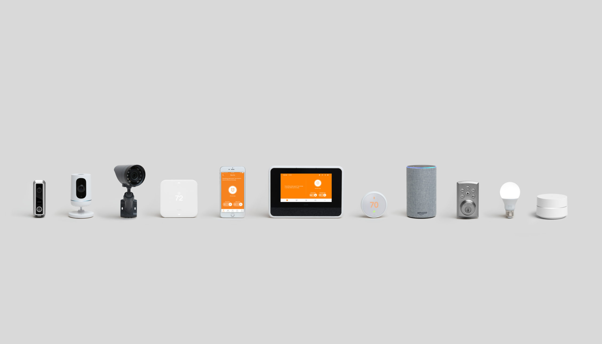
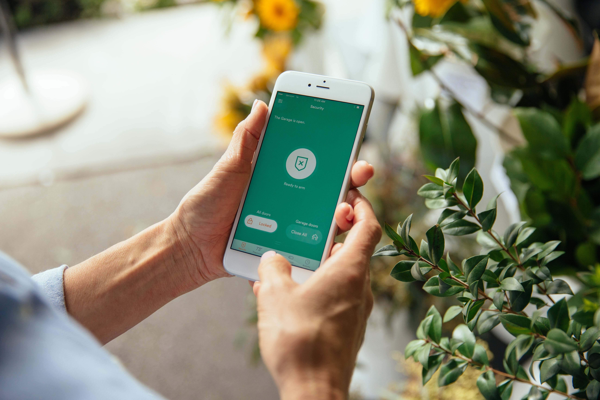
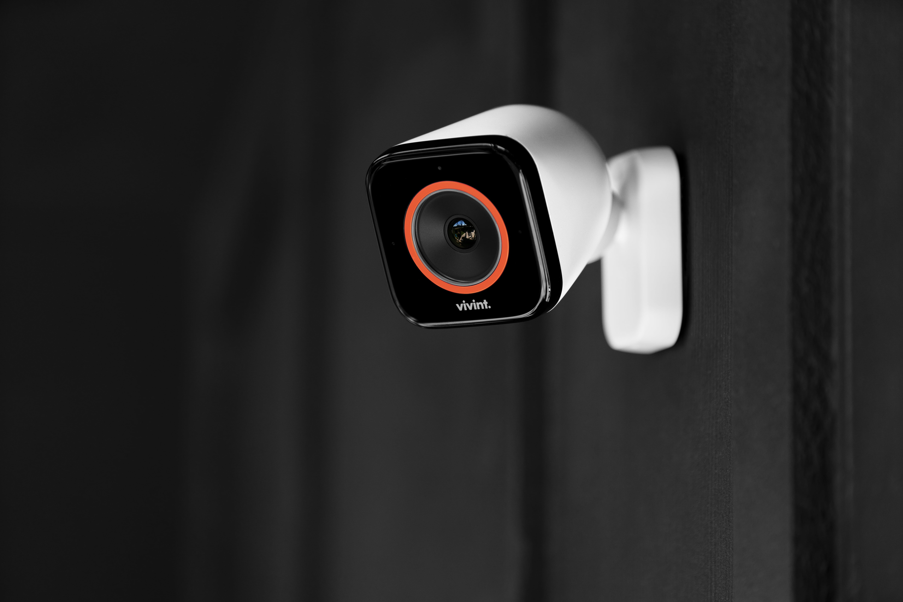
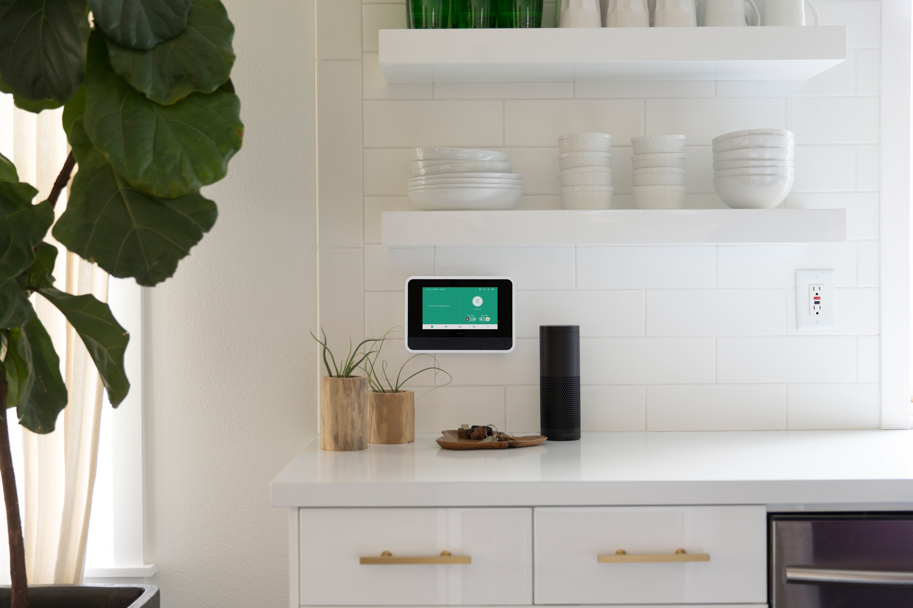
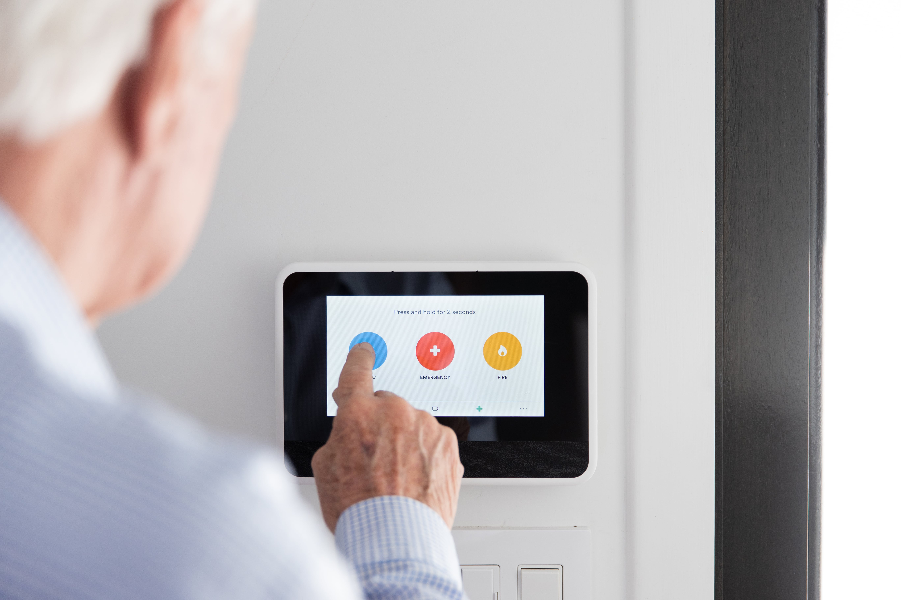

In the short 20 years that Vivint has been in business, they have taken the world by storm with their truly innovative smart home security products. They have become the second largest provider in home security and the largest in smart home security. The convenience and ease of use of their products truly makes them the number one choice for anyone looking for one app to rule everything in your home from thermostat control, garage door opener, door locks and so much more. In this Vivint review, I give you all the details you need to know if Vivint is the right choice for you.

This article goes into detail about features and equipment. However, if you want the quick overview I recommend you check out their explainer video.

## Smart Home

Vivint originally started as just a home security company with monitoring to police, fire, and medical. They use to be known as apex alarms. However in 2011, they re-branded to Vivint due to the increase in demand for home automation. Vivint still includes home monitoring with all of their systems, but now you can control just about anything you can imagine in your home. By simply downloading their app, you can control the alarm, change the temperature of your home, watch the cameras live, and control anything else that connects to the system.

The thing that makes Vivint so unique is that almost all of their products are built and designed by Vivint. Most companies will use third party apps and items to recreate the same experience that Vivint has. The advantage to Vivint is that since everything is built by them it works seamlessly together. No longer are the days of locking your door from your phone and having to wait a whole minute for it to actually lock. The Vivint cameras, app, panel, sensors, and thermostat are all Vivint products. Not to mention that all the monitoring is done inhouse as well. This provides an amazing experience that you would expect from your smart home. Other third party products do connect to the system which I go over later in this review.

## Sky Control Panel

The core of the Vivint system is the Sky Control Panel. This is the main brain of the system. The panel is a 7 inch touchscreen display that connects your to all of your devices wirelessly. The touchscreen display makes using the system, such as changing settings, very easy to do.

Parents with small children will enjoy the chimes that come from the panel. If a door or window is opened, you will hear a voice from the panel say “front door open” or “back door open”. This can be handy if one of the kids tries to make the great escape.

Everything can be controlled from the panel as well as the app. You can arm and disarm the system, control your smart home items, and even watch your cameras. If you are in a position where you don’t have your phone, you can still see your cameras through the panel.

The panel does not require wifi for it to work although it is preferred. The monitoring is done via cell towers, and the connectivity for your smart home items is done through z-wave. The cameras run on their own network which allows them to record to the panel even without wifi. The entire system will still work without wifi except for being able to stream video to your phone.

One of the main complaints people have with home security is that if there is a problem with their system, that have to have a technician come out to their home and fix the problem in person. Vivint solves this problem by allowing for customer service reps to access the panel remotely. This allows them to fix the problem on the spot. If they can’t fix it remotely then the will send someone out in person to fix it.

## Mobile App

No smart home security system is complete without remote access. Vivint gives you the ability to control everything in your home from anywhere in the world as long as you have an internet connection. Everything can be accessed from the smartphone app, the Sky Control Panel, or online through their website.

The app works seamlessly with all of your products. Once you have the ability to control everything you will wonder how you lived without it. The app keeps updated with what is opened or closed, if the door is locked or unlocked, and even what time the door has been opened! Teenagers will have a hard time trying to escape the house with this installed.

The app can handle up to five different users. If you have a partner, kids, or other family member that you want to give access to. You simply create an account for them and give them their username and password.

If you want to experience what the app is like before purchasing, you can download the app to your smartphone or tablet and experience a demo. When you open the app you will be faced with a login screen. To access it use username “demo” and password “demo”.

## Cameras

**Doorbell Camera**

The Vivint Doorbell Camera is a force to be reckoned with. It is one of the highest quality doorbell cameras I have seen on the market. It’s equipped with a 180 degree lens which allows you to see side to side. This way if someone is hugging up against your wall trying not to be seen the camera will still pick up on that person. Two-way talk is available from your mobile device and from the panel inside of the home. This makes looking like your home even if you are away very easy.

The camera is a full 1080p and night vision which allows you to get a great video of that person at your door. The video can be streamed from the app, but it also records any video of activity from the door.

A nice feature added to the camera is a light that appears around the lens to try and grab the attention of the person. This will cause them to look directly at the camera so you know exactly who is there. Built into the lens is a package delivery detection. It can detect boxes sitting on your front porch so you know exactly when those Amazon boxes hit your doorstep.

The lens of the camera also has a built in motion detector. This way you can be notified even if they don’t ring your doorbell. A common complaint with doorbell cameras in general is that the motion sensor will always notify you if someone walks past your house walking on the sidewalk. To solve this problem, Vivint has user defined zones for motion sensor that you can set up to determine how close someone can come to the door before you get an alert. This will help prevent notifications from people jogging or walking their dog in front of your house.

**Inside Camera**

The indoor camera from Vivint has come a long way from when they first released it. Much like the doorbell camera, the indoor camera is also a full 1080p and night vision. It is a wide angle camera that allows the viewer to see a large area with just one camera.

The camera also includes two way talk as well. On top of the camera, there is a button that allows for someone to call out. Once the button is pushed, the customer will receive a notification that will allow you to start talking to the person through the camera.

**4k Outside Cameras with Two Way Talk**

Vivint recently came out with what could be argued as the most powerful outdoor camera with security system on the market. The Vivint outdoor camera has a 4k lens. It is important to note that the camera does not record in 4k. Instead, it allows for a 3x zoom and the resolution will still be high definition. This can be incredible useful for picking up on license plate numbers from far away. Many times, people have video of the people committing a crime, but the camera quality is too low to see who it really is. These cameras try to prevent that from happening.

One of the more interesting features is the ability to have a conversation with a person through camera. Just like most doorbell cameras, Vivint's outside cameras allow for a person to communicate through their phone through the camera. This way you can gather the audio or yell "GET OFF MY PROPERTY".

The camera also comes equipped with a chirping and lighting flash feature.

If you spot someone on your property you can have the camera play a loud chirp sound in hopes of having the person to look at the camera allowing you to get a real good video of that person.

Aside from this, it is equipped with your standard night vision and cloud storage recording. So even if someone destroys the panel or camera you can still access the video. If needed, the video can be stored to your computer as well.

## Smart Home Features

No smart home system is complete without it's automation. Vivint gives you the ability to set automations and triggers for events that happen in your home. For example, if you go to bed at 10PM you can set an automation that every night at 10PM to automatically lock your door, close the garage door, and arm the alarm system. Let's say you consistently forget to close the garage door. You can set an automation to have it close automatically if it's been left open for 15 minutes.

The automations because extremely useful in the case of a fire, for example. If the smoke alarm goes off, Vivint will tell your alarm system to turn off the thermostat. This will slow down the air flow in your home which helps the fire from spreading so much.

## Integrations

Vivint is compatible with other products. In other words, just because a product isn't from Vivint doesn't mean that it can't work it that system. Below is just a quick summary of work will work with their system.

**Amazon Alexa and Google Home**

If you already own an Alexa or Google Home, then there is no need to worry. Both of these products will work with Amazon. You can easily tell Vivint to set your alarm, change the temperature of the home, or to lock your door. It is important to note that you cannot have you Alexa tell Vivint to unlock your door. It simply won't do anything. The same thing goes for your garage door.

**Phillips Hue Lightbulbs**

The hub of the Phillips Hue can connect to your Vivint panel. The option will then appear on your app to be able to turn the lights on and off. This is perfect for anyone who wants to be able to easily control overhead lights. I recommend this method vs trying to switch all of the light switches to z-wave.

**Z-wave Prodcuts**

Many people will have z-wave light switches, sprinkler systems, and thermostats. All of these will appear on your app once connected.

To connect a z-wave product you simply pair it with the panel just like you would a pair of bluetooth headphones to a smartphone.

## Security Features

Vivint may seem like only bells and whistles, but they handle the standard security very well. When the company originally started that is all they use to focus on.

Every Vivint system will come with the basic door and window sensors. They also offer motion and glass breaking sensors to cover bigger rooms with lots of windows. In addition to security, they also cover fire protection as well with monitored smoke alarms. If you already have make smoke detectors in the home, then you may want to consider their firefighter sensor. This will go off is the smoke detector is triggered which can be a cheaper option than buying 10 new smoke detectors.

**Side note: They will not install smoke detectors in a business.**

If you ask for it, they offer a medical pendant which comes at no additional service fee. It comes in two options, one you can wear around the neck and the other you can put on your wrist.

If the app isn’t enough for you, Vivint can install secondary key pads in the house and give you the traditional key fob to turn the alarm on and off. This one is only a traditional rubber button one.

## Can Vivint Use My Existing Equipment?

A common questions asked is "Can Vivint use my existing equipment"? The answer to this is most of the time. A hard wired system is almost a guarantee. This is assuming all the wires and sensors are still good. Vivint claims that upon installation they go through and test all the old sensors to make sure they are in working order. A hard wired system requires a special sensor called a takeover module. The technician will feed all the wires from their central location into the module and then connect it to the Sky Control Panel.

Vivint can work with wireless sensors too. However, it cannot connect to every wireless sensor on the market. Sensors from Simplisafe, DSC, xfinity, at&t security and a few others are examples of what will not connect. Many local companies use a brand called 2Gig for their equipment and that will connect no problem. The best thing you can do is to get a quote with all brand new equipment in case your equipment will not connect.

## Monitoring

Despite all the cool bells and whistles, Vivint is still a home security system at its core. Their 24/7 monitoring service is one of the best in the industry. All of their monitoring is done in house. This allows for them to respond literally within seconds to any emergency. If the alarm goes off, Vivint will start calling down the list of emergency contacts that you set up upon install. If nobody picks up then they dispatch out to the police. Typically, your local police department will contact the officer that is patrolling closest to your home to go and assess the situation.

In addition to calling your list of emergency contacts Vivint will also reach out and try to talk to you through the panel itself. This only happens if the alarm is tripped. The benefit to this is that Vivint can help confirm emergencies as they happen. If someone is running around your home and breaking things, they will be able to hear that. This helps them in determining if there is an actual break in or just a false alarm.

When the alarm is tripped, the siren will reach up to 100 decibels from a couple of feet away. An ambulance with it’s sirens on reaches 110! As you can imagine, anyone trying to get into your home won’t be staying around for too much longer.

In addition to police monitoring, they offer fire and medical monitoring. Some companies will charge extra for fire and medical monitoring, with Vivint however, those features are included in the service already. Some fees will apply for the equipment needed however.

The system can determine which sensor tripped the alarm and dispatch based on that sensor. For example, if the smoke alarm goes off then it will call out to the fire department.

The alarm also comes with it’s basic arm away and arm stay mode. You also have the ability to arm and disarm it through your phone. This makes the system convenient and easy to use in case you forget to arm the system on your way out.

## Customer Service

Vivint as 24/7 customer service available. Other departments such as billing are open only during normal business hours. The wait times can very when calling in from 1-10 minutes in order to get ahold of someone. This is typically for a big company. You can expect to eventually talk to a human being, but it can take a few minutes.

## Installation

Vivint does professional installation for all of their systems. It is rumored that a DIY kit will be released, but as of now they schedule for a technician to come to your home and set everything up. Install time varies from 1 hour all the way up to 5-6 hours depending on the amount of equipment being installed. Usually if you order multiple outside cameras that can make your install time go up.

If you are financing the equipment, which will I will talk about in more detail below, you will need to have a form of identification on spot with you such as a driver's license. The person who will be financing the system must be onsite. For example, if the account is going under your husband's name he will need to be there in person.

Upon arrival they will review the order, walk the home, and finalize everything before setup. During the install, the customer can sit back and watch tv. The technician handles everything and little attention is required after they get started. After the install is when they do their training. Here is where you will set up your list of emergency contacts, create your username and password for the mobile app, and be taught on how to use the service. As the customer, there is very little stress when it comes to getting set up.

## Pricing

Vivnt’s pricing is different from most companies because they split it into two parts. Just like a cell phone plan, they split their billing into two pieces. They have the service portion and the equipment portion. The service portion starts at $29.99 for just basic security monitoring. This includes the app on your phone and monitoring. Security with home automation capability starts at $39.99. The price starts to go up as you add on cameras. The service portion of your bill goes up an additional \$5 per camera.

The equipment starts at \$599 which includes your panel 3 door sensors, 1 motion sensor, and 1 glass break sensor. These can be swapped out for other sensors if needed without increasing your equipment costs.

The equipment can either be purchased up front or rolled up into the bill on a 42 or 60 month payment plan. The equipment is financed at 0% APR as long as you have a credit score of a 650 or higher.

The equipment is yours to keep forever and most of it can be used with other companies if you end up switching later. A common concern is that equipment gets old and breaks overtime. Vivint does provide a warranty on their equipment as long as you are a paying customer.

## Contract

The Vivint service is month to month. This means that you can cancel at any time without penalty. However, you are required to pay for the monthly service if you are financing the equipment. So as long as there is a balance left on your equipment you are required to pay for monitoring. If you want to cancel your service, all you have to pay is just the balance left on your equipment not the service.

## Who is Vivint for?

Vivint is for those who want all the benefits of owning a smart home security system without the hassle of installing it themselves. Their main audience is anyone who enjoys powerful security and automation with a slick interface. Some people will not need all the features that Vivint has. If you want something more standard, there are more affordable options. However, if you don’t want to mess with climbing the ladder and drilling holes to install cameras, then Vivint will be a great option.

## Final Thoughts

It is exciting to see what features that Vivint will come out with next. They are always on the forefront of innovation. The wide variety of products they have to select from gives the customer the chance to have their ultimate dream set up. This company will fit the majority of people searching for home security. Anyone who wants a solid system with modern technology will be very happy with Vivint.
