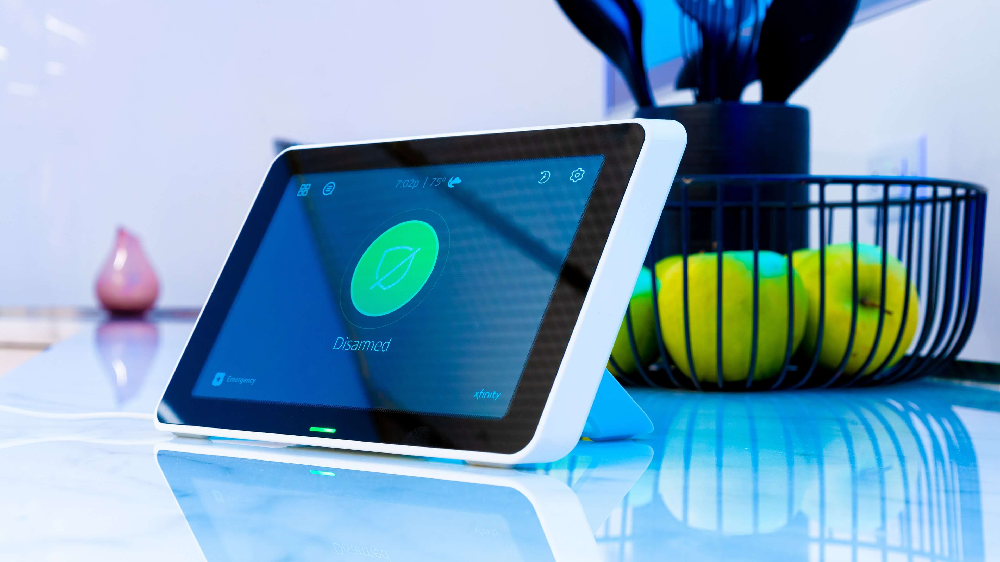

Comcast is widely known for its internet, phone, and tv service that come all packaged together. In some areas, they are the only internet option. Their customer service and quality of internet has been questionable at times. In my personal experience, I had no issues with their internet service. Only a few short years ago did Comcast, their service is known as Xfinity, branch over into the home security service. It was a smart business move since more affordable security options are now available to the customers. They can easily tap into their current book of business and try out this new service to make more money.

In this article I am going to go over my own personal thoughts about how their security system works compared to their competitors. I’ll cover all the equipment, pricing, and details that you need to know if they are a good fit for you. Their newer equipment with their now affordable pricing makes them an attractive option for many people who already use Xfinity service in their home.

## Bundling Services

**Strength: Bundle security with internet to save money**

One of the things that makes Xfinity home security attractive is the ability to bundle it with your current services. When you bundle services with them they can save you a lot of money. They have always been known to haggle around on price when bundling so don’t be afraid to ask them if they can do better. Someone who does not have Xfinity internet can get their home security service. You do not need to be an existing customer to have just only the security service.

Since you can bundle everything it provides a lot of convenience because you just worry about the one bill every month instead of having to deal with multiple bills and multiple due dates. You can just focus on one date a month to pay your bill on. It’s also a plus because you can deal with the same customer service. You don’t have to worry about trying to find phone numbers for different companies. This convenience is what makes them attractive to existing customers.

## Touch Screen Panel

**At a glance**

- Touch Screen Panel
- Comes with kickstand no need to drill holes in wall
- 24 hour backup battery
- Cellular based monitoring (no landline or wifi needed)
- Wifi is only required for cameras

Xfinity security comes with a nice touch screen keypad that makes the system easy to use. One great thing about this panel is that it comes with a kickstand so you can set the panel on a table or night stand. This is a great option for renters because you do not need to drill any holes in the wall to hang the panel up. You simply find an outlet and plug it in! If you own your house, you can mount the panel on the wall if you choose to.

From the panel you can control the whole system. You can turn the alarm one and off, adjust the temperature of the home, turn lights on and off, and even lock and unlock your door. You can also set up automations to have the lights turn off at certain times or always lock your door at 10PM. There are lots of different rules you can set up to truly automate things just like you can with Vivint or ADT. It is important to note that Wifi is required in order to use the cameras and other features within the home. However, Wifi is not required for monitoring. The panel is connected to the cell phone towers in the area which is how it alerts the monitoring station.

The panel does come equipped with a backup battery in case the power goes out. You can unplug it from the power outlet and use it as a tablet around the house. I would not recommend this though because then it can be easily misplaced and you will want to keep the battery charged in case your power goes out. The battery is truly designed as a backup to be used in the case of a power outage.

Overall, it is a really solid panel for the price. I was really impressed with everything that you could do.

**Does Xfinity offer a secondary panel?**

You can get a secondary panel for another part of the house if you want. This panel is just a traditional rubber button style keypad.

**Can I watch my cameras from the panel?**

Yes, you can watch your cameras from the panel, smartphone, or even your tv if you have Xfinity cable. You can even watch multiple cameras at once which is a nice feature. Wifi is required to be able to watch the cameras on the panel or from your phone.

## Mobile App

**At a glance**

- App on smartphone is available

* Use the app to control all devices in the house
* Set up alerts to be notified if you forgot to lock your door etc.

The mobile app is just an extension of the panel. This will give you the ability to control everything remotely. From anywhere, as long as you have cell service, you can turn the alarm on and off, watch the cameras, and change the temperature. Anything you can do from the panel you can do from your phone.

I personally like the look and feel of the app. It is clean looking and easy to use. There were some loading delays at times, but overall it was a smooth experience.

The alerts are the most helpful part of the app. For example, if someone walks in front of the camera you can have it send you an alert. If you forget to lock the door after ten minutes you can have it alert you. It is kind of like having a personal security guard in your pocket.

Having an app on your smartphone for your security and cameras is a must have nowadays and the app from Xfinity proved to be solid.

**Can the app have multiple users?**

Yes, the app can share the username and password and use it across multiple devices.

**Is it available on iphone and android?**

The app is both available for iphone and android.

## Cameras

**At a glance**

- 720p resolution (low compared to other options from competitors)
- Watch the cameras on your tv (if you have Xfinity tv service)
- Pay extra \$10 per month for video recording
- Wireless camera, but there is a cable that needs to be plugged in
- Two way talk is not available

Xfinity only offers one type of camera. It is what they are calling their indoor/outdoor camera. It is a multipurpose camera that is small enough to be used indoors but is also weather resistant. This means that it can be used outside too.

Compared to other cameras, this one is not very good. For starters, the camera quality is only 720p. Most cameras nowadays are at least 1080p and some even going up to 4k. To be fair, 720p would be enough to get a decent quality video of someone, but they would need to be close to the camera.

The camera is equipped with night vision which is a standard feature in all cameras on the market now. So you will still be able to see even if it is pitch black outside. The wide angle lens of 109 degrees is also a nice but standard feature in the majority of cameras that you would find out there today.

Here are the disappointing things about this camera. First off, it doesn’t come with two way talk. Many cameras on the market, including inside and outside, give you the ability to talk to people through the camera. This can be a great feature to make it look like you are home even if you are away. Unfortunately, xfinity doesn’t offer this.

Second, you can only live stream the video to your phone unless you want to pay extra for video recording. Included in their pricing is the ability to be able to stream video all in real time whenever you want. However, if something were to happen and you want to save that video then you need to pay an extra \$10 per month for it! Most companies are offering free video storage for up to 3-7 days and then if you want more you need to pay. Oftentimes, when you do pay, you get 30 day continuous recordings! I feel like that it should be a standard feature now to offer some type of free recordings since that is what all the competitors are doing.

The only real benefit that I see in Xfinity’s cameras that other companies don’t offer is their ability to not only stream the cameras to your phone, but to your tv. If you have Xfinity’s cable service then you can watch your cameras live on your tv. This would make watching them a more enjoyable experience on a bigger screen.

If you are set on using Xfinity, I would not recommend getting their cameras. I would look at other cameras on the market and just use just their security service. [You can check out my review on the top wireless security cameras here.](/best-wireless-security-cameras-for-outdoors)

**Does it come with an app to watch my cameras on?**

Yes, you can watch the cameras live on your phone, computer, and even tv!

**Is the camera wireless?**

This camera will connect to the panel wirelessly, but there is a cable that will need to be plugged into an electrical outlet.

## Smart Home Features

- Xfinity only offers a smart thermostat and smart outlet device
- You can do a full smart home with the help of 3rd party devices that you must get on your own

Almost all security companies nowadays offer some sort of smart home features. Xfinity offers very few but it can connect to many third party solutions if you want to have a complete smart home set up. Their system has the ability to be able to control the temperature of the home, garage door, door lock, and even lights. In this section, I will cover what Xfinity offers from them directly and then in the next section I will include a list of 3rd party devices that will be able to connect to their system.

**Thermostat Control**

Xfinity has partnered up with Zen ecosystems and now offers their Zen thermostat. The device itself is very clean looking. It will light up displaying the temperature and is easy to use. From your phone you will be able to control the temperature of your home. This makes things very convenient.

The best part about a thermostat like this, is the savings that you can get. Since the thermostat and alarm system are connected, it will know when you are home and when you are away. Whenever you leave your house and arm the system, the thermostat will slightly adjust the temperature of the home which uses less energy. This can be a savings of 15%-20% off your energy bill.

I almost alway recommend having a smart thermostat because the cost of the upgrade is typically less than the savings that you get. So you will almost always save money.

**Smart Outlet**

The only other smart home device that is offered through Xfinity is their smart outlet. This device is pretty straightforward. You simply plug it into an electrical outlet, and then you can plug in a lamp, coffee maker, or whatever you want into the device and then control it from your phone. This can be handy if you want your coffee maker on at the same time everyday or if you want to turn on a lamp while you are away to make it look like you are home.

## Integrations

**At a glance**

- Use 3rd party equipment for door locks, garage door, and over head lights
- Works with name brand companies such as Kwikset, Philips Hue, Yale, Chamberlain, and Eobee

The section above goes over what Xfinity offers from their service, which isn’t very much. The good news is that you can go out and purchase your own devices and sync them up to the app. Here is a complete list of exactly which brands and devices their system works with.

[List of 3rd Party Smart Home Devices that Work with Xfinity Home Security](https://www.xfinity.com/support/articles/works-with-xfinity-home-devices)

A few big names are Kwikset, Philips Hue, Yale, Chamberlain, and Eobee. If you were to combine all of those devices together you would have a system similar to Vivint. You would be able to control door locks, garage door openers, and overhead lights through their app. The only downside is that you would have to install them all yourself.

## Security Features

**At a glance**

- Cellular based monitoring
- Monitoring to police and fire
- Only offers door/window sensors, motion sensors, and a smoke detector
- Does not offer glass break, flood/freeze sensor, or a garage door sensor

Xfinity is also pretty limited on security equipment and features. They will provide your basic monitoring to police and fire all through a cellular connection. This makes it the more reliable type of connection. The downside is that there is no two way voice through the panel. Other security companies not only call you on your phone, but they also try to talk to you through the panel itself. It is kind of like an intercom for your home. This can be helpful in case you are in the house in the middle of a breakin because you may not be able to answer your phone trying to fight the person off or flee.

Their security equipment comes with door and window sensors, motion sensors, smoke detectors, and a secondary keypad. They are lacking other important security devices, such as glass break sensors, firefighter devices, and flood sensors. These are basic devices that many other services offer.

The devices that they offer may work for a small apartment, but I would not recommend them for a bigger home. The reason is that when you arm the security system at night the motion sensor is not on. This means that a burglar can walk through the house without setting it off. You will have to have a sensor on every window which can be very expensive.

This setup is better than nothing, but their limited offering cannot provide as good of a setup compared to some of their competitors.

## Can Xfinity use my existing equipment?

**At a glance**

- Xfinity cannot use any existing equipment (wired or wireless)
- No other company can use Xfinity security sensors

Xfinity cannot use security sensors from other companies. They will require you to use only their sensors. They cannot use either an existing wire system or wireless sensors. Most companies that professionally install can use an existing wired system and even wireless sensors depending where they are from.

If you buy sensors from Xfinity, in my personal experience, you cannot use their sensors with other equipment. For example, if you change security providers and want to continue using their sensors no other company is able to connect to them. So you will be forced to buy new sensors all over again.

If you want to prevent this problem I would recommend sticking with companies that offer sensors from 2Gig, GE, or alarm.com. Sensors from these brands can be used across multiple companies. I would always recommend asking the company if they have their own proprietor equipment or if they use sensors from any one of the companies above.

## Monitoring

**At a glance**

- Cellular based monitoring
- No Wifi or landline is needed

The monitoring for Xfinity is solid. Anytime the alarm goes off they call within seconds. The system is able to detect which sensor triggered the alarm so it will determine whether they call police or fire. The panel is able to call out through the cell chip installed inside of the panel. That allows for the alarm to work even if you wifi or power goes out.

## Customer Service

Everyone knows that Comcast has some of the worst customer service. I believe that a big part of this is because of how many customers they have. In my personal experience, it wasn’t that bad. I was able to call in and speak to someone within just a few minutes. I did have to navigate some menus but everything was cleared out. Most people who get this service will understand that it is not going to be the best, but I believe that some of the negative reviews they receive are exaggerated.

## Installation

**At a glance**

- \$50 fee for professional installation
- Option to self install for free

Xfinity has a \$50 install fee to have a professional come out to install it. I would recommend just installing it yourself because you will be able to save money and it is extremely simple. Most alarms require drilling and running wires through the walls to install the panel. The panel from Xfinity just sits on a table and the same goes for the cameras. It doesn’t require someone to be tech savvy to install it.

## Pricing

Xfinity has three different packages with ala carte options if you want to add more on. I’ll briefly review each package and its cost here, but you can always check out their pricing on their website here [https://www.xfinity.com/learn/home-security/devices](https://www.xfinity.com/learn/home-security/devices).

**Base Home System \$15 per Month**

The basic package comes with the panel, 3 door/window sensors, and a motion sensor. The price is $15 per month with a two year service contract. You can do a month to month option if you pay $360 upfront. Even if you pay upfront, the monthly price will still be just \$15.

**Complete Home System \$20 per Month**

This package comes with the panel, 5 door/window sensors, motion sensor, 1 camera, and one secondary keypad. The price for this package is $20 per month and no upfront costs if you sign a two year contract. If you want to not have a contract then you will need to pay $480 upfront.

**Ultimate Home System \$25 per Month**

This package comes with the panel, 10 sensors, 1 motion sensor, 1 keypad, and 2 cameras. It will run $25 per month with a 2 year contract. If you don’t want a contract then you can pay $600 upfront.

## Contract

Xfinity does have a two year contract if you want to avoid paying for the upfront costs. If you are in a position to do so, I would always recommend paying for the equipment up front and avoiding a contract because if you ever need to cancel it you can without penalty.

If you choose to break the contract then you will have to pay your monthly rate times however many months you have left in your agreement. So if you are paying $20 a month and you have 8 months left. Then you would pay $160 to cancel.

## Who is Xfinity for?

Xfinity would be a great fit for anyone who is able to save money by getting the security package into their already existing services. Another great fit would be if you have bad credit and are not able to afford the cost of the equipment up front. You could simply sign up for their two year contract and pay for the low monthly fee. Most companies will make you pay upfront, or just not be able to service you at all.

I would not recommend Xfinity if you are wanting more diversity in your equipment or if you don’t have any existing Xfinity service and want a low price. There are other options available for a lower price such as Ring alarm. These companies offer much more equipment and that equipment has better features than what you would find with Xfinity. It is because of these reasons that I put it into my “better than nothing” category. It is always better to have some system than nothing at all.

## Final Thoughts

Xfinity is going to fall into my better than nothing category. Their system is not as good as other companies that are on the market, but it would be better than no security at all. The only real unique feature that they provide is the ability to watch the security cameras on your tv and that is only if you have their tv service.

The lack of security equipment makes the system feel as if it was rushed to be put together and pushed to market. Rather than taking their time to provide a quality service. There is a lot of convenience to having all the services bundled together which is nice. Sometimes that can even save you money. However, if you really want a diverse system you can check out my other article on the top home security systems.
